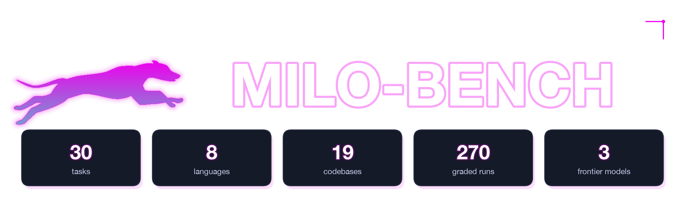
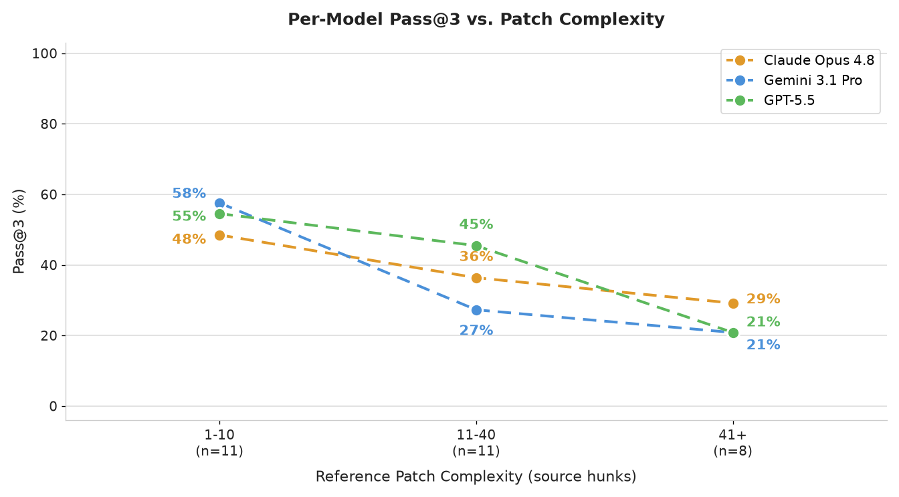
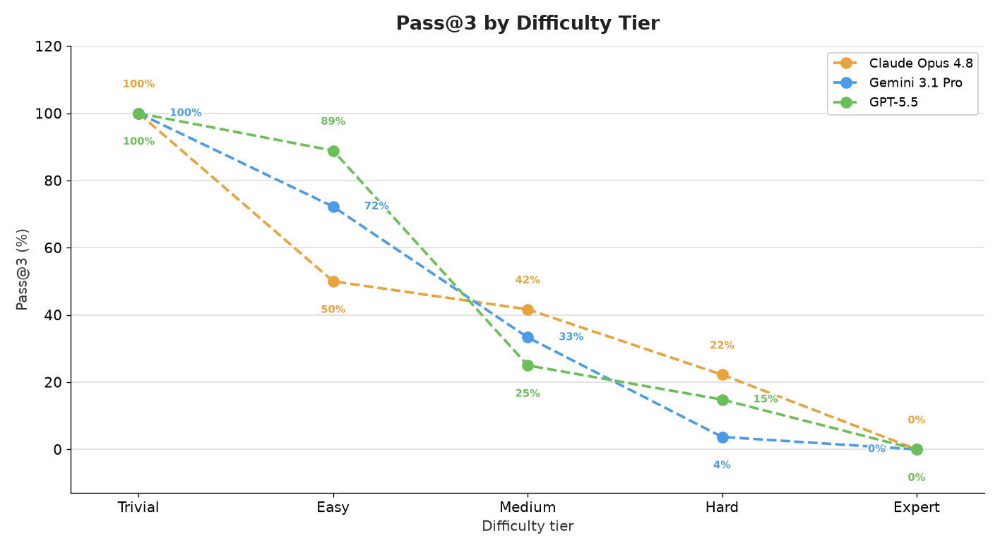
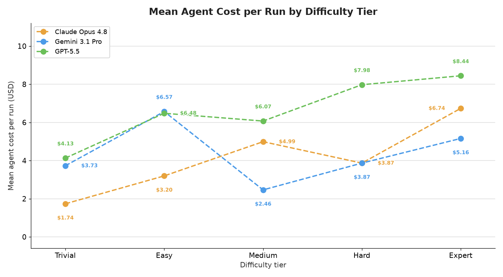
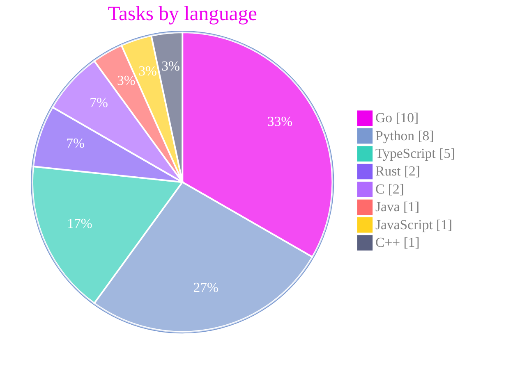
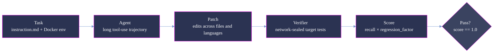

<p align="center">
  
</p>

<p align="center">
  <strong>Measuring long-horizon software-engineering competence at the granularity of milestones.</strong>
</p>

<p align="center">
  <a href="#summary"></a>
  <a href="#scoring-methodology"></a>
  <a href="#scoring-methodology"></a>
  <a href="#verification-and-quality-assurance"></a>
</p>

<p align="center"><sub>
  <a href="#summary">Summary</a> · <a href="#repository-layout">Layout</a> · <a href="#difficulty-tiers">Tiers</a> · <a href="#results-pass-rate-vs-reference-patch-complexity">Results</a> · <a href="#analysis">Analysis</a> · <a href="#coverage">Coverage</a> · <a href="#dataset-structure">Dataset</a> · <a href="#trajectory-structure">Trajectories</a> · <a href="#scoring-methodology">Scoring</a> · <a href="#reproduction">Reproduction</a> · <a href="#verification-and-quality-assurance">Verification</a>
</sub></p>

# Milo-Bench: 30-Task Evaluation Sample

**Milo-Bench measures long-horizon software-engineering capability, not just isolated coding ability.**
It evaluates whether an agent can complete milestone-scale engineering tasks that span multiple
files, languages, and architectural components while keeping an existing production codebase correct,
not the individual functions or short bug fixes that narrower benchmarks target. Where SWE-bench and
Multi-SWE-bench score single-issue fixes, Milo-Bench targets whole milestones resolved across a
codebase over a long agent trajectory.

This is a curated **30-task** sample from Milo-Bench. Each task is a self-contained, containerized
issue-resolution problem, paired with the complete agent trajectories of three frontier models
(Claude Opus 4.8, Gemini 3.1 Pro, and GPT-5.5) at 3 runs per model, for 270 graded runs in total,
each scored by the Milo-Bench verifier.

Tasks are grouped into five difficulty tiers (Trivial, Easy, Medium, Hard, Expert),
calibrated from observed difficulty on this sample, and cover 8 languages across 19 codebases.

Each model's pass rate declines as reference-patch scope (`src_hunks`) grows. See
[Results](#results-pass-rate-vs-reference-patch-complexity) for how `src_hunks` is defined.



> **This is a representative, quality-controlled sample of the full Milo-Bench corpus,** provided
> for evaluation. The dataset format, trajectory format, and scoring are identical to the
> production benchmark.

## Summary

| Property            | Value                                                                              |
| :------------------ | :--------------------------------------------------------------------------------- |
| Tasks               | **30** (Trivial 5 / Easy 6 / Medium 4 / Hard 9 / Expert 6)                         |
| Difficulty tiers    | 5, by **observed difficulty**                                                      |
| Models evaluated    | Claude Opus 4.8, Gemini 3.1 Pro, GPT-5.5                                           |
| Runs & grid         | 3 per model (`run_1`/`run_2`/`run_3`) = 9 per task, 270 total; full 3 × 3, no gaps |
| Score               | continuous score in [0, 1] (partial credit), per run in `result.json`              |
| Languages           | 8 (Go, Python, TypeScript, Rust, C, Java, JavaScript, C++)                         |
| Codebases           | 19                                                                                 |

**Pass rates on this sample** (see [Scoring methodology](#scoring-methodology) for how pass@3 is
defined):

| Metric                     | Value |
| :------------------------- | ----: |
| Claude Opus 4.8 **pass@3** | 38.9% |
| Gemini 3.1 Pro **pass@3**  | 36.7% |
| GPT-5.5 **pass@3**         | 42.2% |

## Repository layout

```
milo-bench-samples/
├── README.md                 # this document
├── assets/                   # figures
│   ├── pass_rate.png
│   ├── pass_rate_by_tier.png
│   └── cost_by_tier.png
├── dataset/                  # task definitions, one directory per UUID (30)
│   └── <uuid>/ ...
└── trajectories/             # model runs, one directory per UUID (30)
    └── <uuid>/<model>/run_N/ ...   # model ∈ {claude-opus-4-8, gemini-3.1-pro-preview, gpt-5.5}
```

Task UUIDs match **1:1** between `dataset/` and `trajectories/` (30 each). Under each task, all
three models appear as `<model>/` directories, each containing exactly three `run_N/` samples.

## Difficulty tiers

The 30 tasks are stratified into five tiers by observed difficulty on this sample: how consistently
the three models solve each task across its runs. Trivial tasks are solved by nearly every run;
Expert tasks by none. This is an **outcome-based** stratification, computed from
the runs shipped here, so the tiers describe what the models actually experienced rather than any
property fixed in advance.



| Tier        |   n | mean score |
| :---------- | --: | ---------: |
| **Trivial** |   5 |      1.000 |
| **Easy**    |   6 |      0.773 |
| **Medium**  |   4 |      0.478 |
| **Hard**    |   9 |      0.316 |
| **Expert**  |   6 |      0.210 |

## Results: pass rate vs reference-patch complexity

`src_hunks` is the number of independent source edit sites in the reference patch
(`solution/fix.patch`). It is a property of the human reference solution, computed before any model
runs. Tier (pass rate) and `src_hunks` (reference-patch scope) are correlated but distinct: pass
rate falls as patch complexity rises (the figure at the top of this document), but a small patch can
still be Hard and a large one Easy. Difficulty here reflects what the models experienced, not patch
size.

Per-task figures are derivable directly from the shipped files: `src_hunks` from
`dataset/<uuid>/task.toml` (`[metadata].src_hunks`) and per-run scores from
`trajectories/<uuid>/<model>/run_N/result.json` (and `verifier/score.md`).

**Per-tier pass@3 by model** (fraction of each model's runs in the tier that fully solved the task,
score = 1.0):

| Tier (n)    | Claude Opus 4.8 | Gemini 3.1 Pro | GPT-5.5 |
| :---------- | --------------: | -------------: | ------: |
| Trivial (5) |          100.0% |         100.0% |  100.0% |
| Easy (6)    |           50.0% |          72.2% |   88.9% |
| Medium (4)  |           41.7% |          33.3% |   25.0% |
| Hard (9)    |           22.2% |           3.7% |   14.8% |
| Expert (6)  |            0.0% |           0.0% |    0.0% |

**Per-tier mean score by model** (mean continuous score across each model's runs in the tier,
partial credit in [0, 1]):

| Tier (n)    | Claude Opus 4.8 | Gemini 3.1 Pro | GPT-5.5 |
| :---------- | --------------: | -------------: | ------: |
| Trivial (5) |          100.0% |         100.0% |  100.0% |
| Easy (6)    |           58.3% |          75.0% |   98.6% |
| Medium (4)  |           50.0% |          41.2% |   52.3% |
| Hard (9)    |           49.8% |          15.6% |   29.2% |
| Expert (6)  |           38.2% |           8.3% |   16.5% |

With 30 tasks across five tiers, these are an average tendency on a small, curated sample rather
than a precise law.

In contrast, inference cost rises as task difficulty increases.



## Analysis

Milo-Bench brings together two directions earlier benchmarks pursued separately. Multi-SWE-bench
widened issue resolution from Python to seven more languages, but kept each task a single issue
closed by a single patch. SWE-EVO went the other way, raising the task to release-scale evolution
where agents that clear most of single-issue SWE-bench solve only about a quarter of the tasks, but
it stays Python-only. Milo-Bench is the one benchmark that does both at once: milestone-scale tasks
that span a codebase, across eight languages, scored on a continuous scale so partial progress on a
long task stays visible. Because these benchmarks use different task sets, the rates above are not
directly comparable to the pass rates reported here.

Pass rate captures how hard the tasks are, not how far apart the models are. As difficulty rises,
pass rate and mean score both fall while cost climbs, but pass rate flattens exactly where the
models differ most. Every model scores 0% on the Expert tier, so pass rate calls all three identical
there; by mean score, Claude Opus 4.8 completes 38% of an average Expert task, GPT-5.5 17%, and
Gemini 3.1 Pro 8%. The Hard tier shows the same compression (pass@3 of 22 / 4 / 15 against mean
scores of 50 / 16 / 29).

This happens because a run earns a pass only when every target test passes: one that resolves most
of a milestone-scale task but misses a single site scores the same zero as one that did nothing.
Mean score keeps crediting that partial progress, so it stays informative where pass rate bottoms
out.

The metric can even flip the ranking. By per-model pass@3 the order is GPT-5.5 (42.2%) ahead of
Claude Opus 4.8 (38.9%) and Gemini 3.1 Pro (36.7%); by mean score it is Claude Opus 4.8 (57.6%)
ahead of GPT-5.5 (55.4%) and Gemini 3.1 Pro (43.5%). The Medium tier flips the same way: GPT-5.5 is
last by pass@3 (25%) but first by mean score (52%), because it often gets most of the way without
landing the exact 1.0. A reader who took only the pass figures away would name the wrong strongest
model.

Cost analysis complements these results by showing the efficiency-performance trade-off: GPT-5.5
is the priciest model at almost every tier, while
Claude Opus 4.8 is the cheapest on the easy end and the most cost-efficient overall given its
mean-score lead.

These separations are trustworthy only because the scores cannot be gamed: grading is network-sealed,
and any run that reached for a task's reference solution or edited the graded tests was rejected
rather than scored. A model's standing reflects the task it solved, not an answer it found.

## Coverage

| Language   | Tasks |     | Language   | Tasks |
| :--------- | ----: | :-- | :--------- | ----: |
| Go         |    10 |     | C          |     2 |
| Python     |     8 |     | Java       |     1 |
| TypeScript |     5 |     | JavaScript |     1 |
| Rust       |     2 |     | C++        |     1 |

**19 codebases.** Most-represented: 99designs/gqlgen (4), Textualize/rich (4),
langchain-ai/langchain (3), clap-rs/clap (2), babel/babel (2), seaweedfs/seaweedfs (2); the
remaining 13 contribute a single task each. Each task bundles a milestone-scale change set
(1 to 253 referenced PRs/issues).



## Dataset structure

Each task lives under `dataset/<uuid>/` and is fully self-contained:

```
dataset/<uuid>/
├── task.toml                 # metadata (incl. [metadata].src_hunks), resource and network policy
├── instruction.md            # the prompt presented to the agent
├── environment/
│   └── Dockerfile            # builds the repository at its base commit
├── solution/
│   ├── fix.patch             # the reference ("oracle") source patch
│   └── solve.sh              # applies and commits the oracle patch
└── tests/
    ├── config.json           # test transitions and the canonical test list
    ├── run_tests.py          # the verifier entry point
    ├── test.patch            # the grading tests, applied before scoring
    └── test.sh               # runs run_tests.py against config.json
```

During a run the agent sees only the built repository, `instruction.md`, and the environment.
`solution/` and `tests/` are used exclusively by the verifier and are never exposed to the agent.
The **target** tests the agent must newly pass are the union of fail-to-pass, skip-to-pass, and
none-to-pass tests (`f2p ∪ s2p ∪ n2p`) from `tests/config.json`; the **preserve set** that must not
regress is the already-passing tests.

## Trajectory structure

Each run lives under `trajectories/<uuid>/<model>/run_N/`:

```
trajectories/<uuid>/<model>/run_N/        # model ∈ {claude-opus-4-8, gemini-3.1-pro-preview, gpt-5.5}; N ∈ {1,2,3}
├── result.json            # config, agent metrics, verifier score + diagnostics
├── config.json            # the run configuration
├── agent/
│   ├── trajectory.json     # structured step-by-step trace (steps[] with tool_calls + observations)
│   ├── recording.cast      # asciinema v2 terminal recording
│   └── <model>.pane        # terminal pane snapshot (opus.pane / gemini.pane / gpt.pane)
├── artifacts/manifest.json
└── verifier/
    ├── score.md            # the final score (single float)
    └── test-stdout.md      # verifier test output
```

Key `result.json` fields: `verifier_result.scores.score` (continuous score ∈ [0, 1]),
`verifier_result.scores.score_binary` (strict all-or-nothing), `verifier_result.status`,
`verifier_result.diagnostics` (recall, regression factor, target/preserve counts), and
`agent_result` (token usage, `cost_usd`, episodes). The bare score is also in `verifier/score.md`.
The authoritative model id is `config.agent.model_name` (`claude-opus-4-8`,
`gemini-3.1-pro-preview`, `gpt-5.5`).

## Scoring methodology



The verifier computes a continuous score per run:

```
score = recall × regression_factor
```

- **Recall** = newly-passing target tests / effective targets (`f2p ∪ s2p ∪ n2p`, baseline-subtracted
  so only genuinely newly-passing tests count).
- **Regression factor** = `1 - penalty`, where the penalty scales preserve-set tests the patch breaks
  against a fixed denominator; it is 1.0 for the large majority of runs (score then equals recall).

A run solves a task only when its continuous score is exactly 1.0 (`score_binary = 1`).
Throughout this document, pass@3 is a run-level rate: a model's solved runs divided by its total
runs, not a per-task "at least one of 3 runs solved" metric. The verifier runs
network-sealed (`task.toml [verifier].network_mode = "none"`) so the reference solution cannot
influence a run.

Every task ships a human-authored reference patch at `solution/fix.patch` that passes all target
tests and scores 1.0 by construction: the target tests (`f2p ∪ s2p ∪ n2p`) are defined as the tests
this patch flips to passing. This guarantees the grading harness is self-consistent (each task has a
known-good solution under its own tests); it is **not** an independent measure of real-world
solvability.

## Reproduction

Image-building, agent execution, and scoring are orchestrated by the **Milo-Bench harness**. The
score and full diagnostics for every run are in `trajectories/<uuid>/<model>/run_N/result.json`,
with the bare score in `verifier/score.md`.

### Recompute the pass rates yourself

No trajectory re-execution is needed. Read the shipped scores directly:

```python
import json, glob, collections
def solved(run_dir):                      # a run "solves" iff score == 1.0
    r = json.load(open(f"{run_dir}/result.json"))
    return float(r["verifier_result"]["scores"]["score"]) == 1.0
# pass@3 per model = fraction of that model's runs that solved (score == 1.0)
by_model = collections.defaultdict(list)
for rd in glob.glob("trajectories/*/*/run_*"):
    by_model[rd.split("/")[2]].append(solved(rd))
for model, runs in sorted(by_model.items()):
    print(f"{model} pass@3 = {sum(runs) / len(runs):.3f}")
# -> claude-opus-4-8 0.389 · gemini-3.1-pro-preview 0.367 · gpt-5.5 0.422
```

`src_hunks` (used for the complexity axis of the figure) is recorded per task in
`dataset/<uuid>/task.toml` under `[metadata].src_hunks` and is reproducible directly from
`solution/fix.patch` (counted over hand-written source files only, excluding generated, test,
doc, and config files).

## Verification and quality assurance

This sample passed a QC gate prior to delivery:

- **Structure.** 30 dataset and 30 trajectory directories, matched 1:1 by UUID; required files
  present and non-empty in every task and every run; the full 3 × 3 grid (270 runs) is complete; the
  terminal-pane filename matches the model.
- **Score integrity.** Every score is read directly from a `result.json`; `verifier/score.md`
  agrees with `result.json` on every run; `config.agent.model_name` matches the model directory.
- **Reward-hacking resistance.** Every observed attempt to fetch a task's reference solution from its
  **own source repository** (the merged PR, raw blobs, the commit/diff endpoints) returned a policy
  block / `HTTP 403`; **no run obtained its gold solution from the network.**
- **Fair play.** The agent is never given the reference solution (`solution/`) or the grading tests
  (`tests/`); these are mounted only for the verifier (`network_mode = "none"`).
- **No defective evals.** Every run is either verifier-`scored` or is a **legitimate model failure**
  (e.g., the model emitted an unapplyable patch, or edited graded test files and was blocked by the
  fix-patch guard). The sample contains **no infrastructure, environment, or reference-patch
  defects**: on every task the gold patch applies and the harness grades correctly, demonstrated by
  the runs that score on that same task. 25 of 30 tasks are fully scored across all 9 runs; the
  remaining 5 each contain one to three runs that legitimately failed for a model-side reason.
- **Limitations.**
  - **Sample size.** 30 tasks (roughly 4 to 9 per tier) with 3 runs per model; per-tier and per-language
    breakdowns are averages on small n with real run-to-run variance, not precise estimates.
  - **Contamination.** Tasks come from public codebases; whether any appeared in a model's training
    data is unknown, so pass rates are not a contamination-free measure of difficulty.
  - **Model nondeterminism.** The same model can produce different outputs for the same task, so a
    model's results vary somewhat from run to run.
