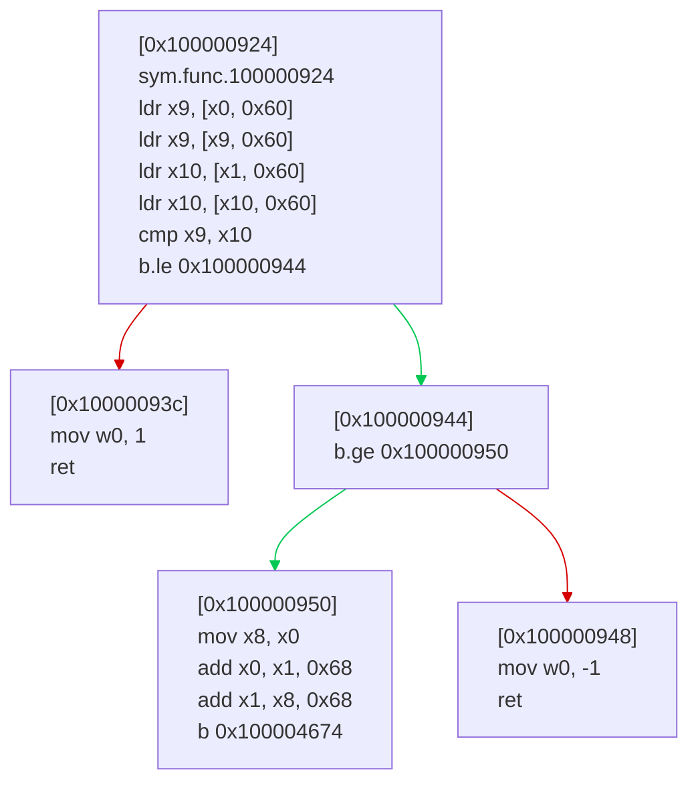

I've uploaded a C code repository in the directory /workspace/radare2. Consider the following issue description:

<issue_description>
# Fix the xcframework path

## Issue 1 (#1234): Verify rabin2 -B and fix ASLR rbin info (r2 -d) and r2 -m?

## Issue 2 (#25173): Implement print fpu registers for linux-arm/arm64 ##debug

## Issue 3 (#25036): rasm2 Gives Wrong Output When Invalid Registers Are Involved

## Environment

```sh
Sun Dec 14 07:14:26 PM EET 2025
radare2 6.0.7 34644 @ linux-x86-64
birth: git.6.0.7-148-gdca8fb249c 2025-12-14__15:39:50
commit: dca8fb249c0d33ac4f0fdf280ecc0cdffbe19e79
options: gpl -O? cs:5 cl:2 make
Linux x86_64
```

## Description

There are numerous examples, I'll list those I found:

The command ```rasm2 -a x86 'push rx'``` where x is any number besides 8-15 always yields "6a00"
for example: 
```sh
$ rasm2 -a x86 'push r9283293982'
6a00
```

The command ```rasm2 -a x86 'add rax, r1'``` outputs "4c01d0", which corresponds to ```addq %r10, %rax```

Likewise, ```rasm2 -a x86 'mov rax, r1'``` outputs the opcode for ```movq %r10, %rax```

```rasm2 -a x86 'lea rax, [r1]'``` outputs "488d02" which corresponds to ```leaq (%rdx), %rax```
```rasm2 -a x86 'xchg rax, r1'``` outputs "4992" which corresponds to ```xchgq %rax, %r10```
etc.
Generally, r1 is mistaken as some other register, most of the times, as r10, but there are exceptions.

## Test

Run any of the commands I supplied above, or use "r1" as a source or destination operand in rasm2 assembler.

## Issue 4 (#25179): merge csnext and sslcrypto jobs

i think we should be good to have only one job to test csnext,libuv and ssl instead of 2 separate ones.

wdyt @prodrigestivill

## Issue 5 (#25200): Dont use RHash from RCoreBinFile

## Issue 6 (#25206): Fix last issues spotted by coverity scan

* Update otezip to resolve a dead code warning
* CID 1643470 - null deref in armass64
* CID 1643469 - off by one in rapserver
* CID 1643468 - memory leak in RBinField
* CID 1643467 - memory leak in vslides

## Issue 7 (#25208): Missing NULL checks in Big Endian read functions (inconsistent with Little Endian counterparts)

## Summary

The `r_read_be*` family of functions in `libr/include/r_endian.h` lack NULL pointer checks, while their Little Endian counterparts (`r_read_le*`) properly handle NULL inputs. This inconsistency can lead to crashes when NULL pointers are passed, especially through the unified `r_read_ble*` wrapper functions.

## Affected Functions

### Missing NULL checks (Big Endian)

| Function | Line |
|----------|------|
| `r_read_be16()` | 50 |
| `r_read_be32()` | 70 |
| `r_read_be64()` | 98 |
| `r_read_at_be16()` | 55 |
| `r_read_at_be32()` | 76 |
| `r_read_at_be64()` | 104 |
| `r_read_at_me64()` | 314 |

### Have NULL checks (Little Endian) ✓

| Function | Line |
|----------|------|
| `r_read_le16()` | 140 |
| `r_read_le24()` | 173 |
| `r_read_le32()` | 189 |
| `r_read_at_le16()` | 148 |
| `r_read_at_le32()` | 198 |

## Code Comparison

**Little Endian (safe):**
```c
static inline ut16 r_read_le16(const void *src) {
    if (!src) {
        return UT16_MAX;
    }
    const ut8 *s = (const ut8*)src;
    return (((ut16)s[1]) << 8) | (((ut16)s[0]) << 0);
}
```

**Big Endian (unsafe):**
```c
static inline ut16 r_read_be16(const void *src) {
    const ut8 *s = (const ut8*)src;  // No NULL check!
    return (((ut16)s[0]) << 8) | (((ut16)s[1]) << 0);
}
```

## Critical Issue: `r_read_ble*` Wrapper Inconsistency

The unified wrapper functions exhibit **inconsistent behavior** depending on endianness:

```c
static inline ut16 r_read_ble16(const void *src, bool big_endian) {
    return big_endian? r_read_be16 (src): r_read_le16 (src);
}
```

When `src` is NULL:
| Endianness | Result |
|------------|--------|
| `big_endian = false` | Returns `UT16_MAX` (safe) |
| `big_endian = true` | **CRASH** (NULL pointer dereference) |

## Why This Matters: `RAnalOp.bytes` "can be null"

In `libr/include/r_anal/op.h`, the `bytes` field is **explicitly documented as nullable**:

```c
typedef struct r_anal_op_t {
    // ...
    ut8 *bytes;     /* can be null, but is used for encoding and decoding, malloc of `size` */
    // ...
} RAnalOp;
```

Multiple arch plugins directly use `op->bytes` with these read functions:

```c
// libr/arch/p/riscv/plugin.c:359
word = r_read_ble16 (buf, be);  // buf = op->bytes

// libr/arch/p/chip8/plugin.c:13
ut16 opcode = r_read_be16 (op->bytes);

// libr/arch/p/h8300/h8300_disas.c:146
ext_opcode = (r_read_be16 (bytes)) >> 7;
```

Since `bytes` is documented as potentially NULL, any function using it should handle that case - but the BE read functions do not.

## Suggested Fix

Add NULL checks to all Big Endian read functions to match their Little Endian counterparts:

```c
static inline ut16 r_read_be16(const void *src) {
    if (!src) {
        return UT16_MAX;
    }
    const ut8 *s = (const ut8*)src;
    return (((ut16)s[0]) << 8) | (((ut16)s[1]) << 0);
}

static inline ut32 r_read_be32(const void *src) {
    if (!src) {
        return UT32_MAX;
    }
    const ut8 *s = (const ut8*)src;
    return (((ut32)s[0]) << 24) | (((ut32)s[1]) << 16) |
        (((ut32)s[2]) << 8) | (((ut32)s[3]) << 0);
}

static inline ut64 r_read_be64(const void *src) {
    if (!src) {
        return UT64_MAX;
    }
    ut64 val = ((ut64)(r_read_be32 (src))) << 32;
    val |= r_read_at_be32 (src, sizeof (ut32));
    return val;
}
```

## Impact

| Aspect | Assessment |
|--------|------------|
| **Severity** | Medium (potential DoS via crash) |
| **Type** | Code consistency / Defensive programming |
| **Affected architectures** | Any big-endian target (RISC-V BE, MIPS BE, PPC, SPARC, etc.) |
| **Exploitability** | Low - requires specific code path to pass NULL |

## References

- `libr/include/r_endian.h` - affected functions
- `libr/include/r_anal/op.h:238` - `bytes` field documentation
- `libr/arch/p/riscv/plugin.c:359` - example usage
- `libr/arch/p/chip8/plugin.c:13` - example usage

## Issue 8 (#25212): Heap Buffer Overflow in `r_str_len_utf8()`

## Summary

A heap-buffer-overflow (out-of-bounds read) vulnerability exists in `r_str_len_utf8()` function. The function passes a hardcoded value `4` to `r_str_char_fullwidth()` without checking the actual remaining string length, causing OOB read when processing truncated UTF-8 sequences.

## Vulnerable Code

**File:** `libr/util/str.c` (lines 2823-2835)

```c
R_API size_t r_str_len_utf8(const char *s) {
    size_t i = 0, j = 0, fullwidths = 0;
    while (s[i]) {
        if ((s[i] & 0xc0) != 0x80) {
            j++;
            if (r_str_char_fullwidth (s + i, 4)) {  // BUG: hardcoded 4
                fullwidths++;
            }
        }
        i++;
    }
    return j + fullwidths;
}
```

The issue is that `r_str_char_fullwidth(s + i, 4)` always passes `left=4`, regardless of how many bytes actually remain in the string.

This propagates to `r_str_utf8_codepoint()` which then attempts to read up to 4 bytes:

```c
// str.c:2318-2320
} else if ((*s & 0xf8) == 0xf0 && left > 3) {  // left=4 > 3, condition is true!
    return ... + (*(s + 1) & 0x3f) ...   // OOB read
               + (*(s + 2) & 0x3f) ...   // OOB read
               + (*(s + 3) & 0x3f);      // OOB read
}
```

## Proof of Concept

### PoC Command

```bash
radare2 -qc $'P \xf0' /bin/ls
```

This command attempts to open a project named `\xf0` (a 4-byte UTF-8 sequence prefix with only 1 byte present).

### ASAN Output

```
==916422==ERROR: AddressSanitizer: heap-buffer-overflow on address 0x50200010acb4 at pc 0x7c0be213946c bp 0x7ffc52e8c260 sp 0x7ffc52e8c250
READ of size 1 at 0x50200010acb4 thread T0
    #0 0x7c0be213946b in r_str_utf8_codepoint /home/qky/github_repo/radare2/libr/util/str.c:2320
    #1 0x7c0be213954c in r_str_char_fullwidth /home/qky/github_repo/radare2/libr/util/str.c:2329
    #2 0x7c0be213c8a2 in r_str_len_utf8 /home/qky/github_repo/radare2/libr/util/str.c:2829
    #3 0x7c0be0dcdc05 in is_valid_project_name /home/qky/github_repo/radare2/libr/core/project.c:15
    #4 0x7c0be0dcdf18 in get_project_script_path /home/qky/github_repo/radare2/libr/core/project.c:38
    #5 0x7c0be0dd02d6 in r_core_project_open /home/qky/github_repo/radare2/libr/core/project.c:391
    #6 0x7c0be0adfc4a in cmd_project /home/qky/github_repo/radare2/libr/core/cmd_project.inc.c:160
    #7 0x7c0be0d8d146 in r_cmd_call /home/qky/github_repo/radare2/libr/core/cmd_api.c:414
    #8 0x7c0be0c97f98 in r_core_cmd_subst_i /home/qky/github_repo/radare2/libr/core/cmd.c:5474
    #9 0x7c0be0c8d36c in r_core_cmd_subst /home/qky/github_repo/radare2/libr/core/cmd.c:4105
    #10 0x7c0be0c9f94f in run_cmd_depth /home/qky/github_repo/radare2/libr/core/cmd.c:6473
    #11 0x7c0be0ca079b in r_core_cmd /home/qky/github_repo/radare2/libr/core/cmd.c:6587
    #12 0x7c0be0ca0e74 in r_core_cmd_lines /home/qky/github_repo/radare2/libr/core/cmd.c:6651
    #13 0x7c0be1fa5b1c in run_commands /home/qky/github_repo/radare2/libr/main/radare2.c:440
    #14 0x7c0be1fb26b6 in r_main_radare2 /home/qky/github_repo/radare2/libr/main/radare2.c:1886
    #15 0x5e964e8edb5d in main /home/qky/github_repo/radare2/binr/radare2/radare2.c:119

SUMMARY: AddressSanitizer: heap-buffer-overflow /home/qky/github_repo/radare2/libr/util/str.c:2320 in r_str_utf8_codepoint
```

### Call Chain

```
radare2 -qc 'P \xf0' /bin/ls
    ↓
cmd_project()                    [cmd_project.inc.c:160]
    ↓
r_core_project_open()            [project.c:391]
    ↓
get_project_script_path()        [project.c:38]
    ↓
is_valid_project_name("\xf0")    [project.c:15]
    ↓
r_str_len_utf8("\xf0")           [str.c:2829]  ← Vulnerable function
    ↓
r_str_char_fullwidth(s, 4)       [str.c:2329]  ← Hardcoded left=4
    ↓
r_str_utf8_codepoint(s, 4)       [str.c:2320]  ← OOB read of s[1], s[2], s[3]
```

## Environment

- **Version:** radare2 latest (git master)
- **OS:** Linux
- **Build:** Compiled with AddressSanitizer (`SANITIZE="address" sys/sanitize.sh`)

## Issue 9 (#25233): Optimize symbol loading for large binaries

- [x] Mark this if you consider it ready to merge
- [ ] I've added tests (optional)
- [ ] I wrote some lines in the [book](https://github.com/radareorg/radare2book) (optional)

**Description**

  - Bulk read symbol table instead of per-symbol I/O in parse_symtab
  - Check for "<redacted>" once per binary instead of per-symbol
  - Add skip_symbols option to avoid re-parsing symbols for dSYM files
  - Use lookup tables for r_name_validate_char/dash/shell functions
  - ~Cache demangled names to avoid redundant r_bin_demangle calls~
  - Remove redundant flag lookups in bin_symbols

  Reduces load time for 450k symbol binary from ~35s to ~13s (on mac m3).

## Issue 10 (#25232): x86_64 "dec sil" encodes improperly

## Environment

Tested on 3 systems and found the same result:

Ubuntu 22.04 LTS:
Thu Jan 15 12:17:16 PM PST 2026
radare2 6.0.8 +0 abi:54 @ linux-x86-64
birth: git.6.0.8 2026-01-12__18:11:14
commit: 6.0.8
options: gpl release -01 cs:5 cl:0 make
Linux x86_64

Kali:
Thu Jan 15 12:47:41 PM PST 2026
radare2 6.0.5 +0 abi:54 @ linux-x86-64
birth: git.6.0.5 2025-09-29__06:39:34
options: gpl release -01 cs:5 cl:2 meson

Windows 11 (also tried on 5.4 and 6.0.4 with similar results):
Thursday, January 15, 2026 12:49:21 PM
radare2 6.0.8 +1 abi:54 @ windows-x86-64
birth: git.6.0.8 Tue 12/30/2025__13:15:15.29
commit: 151a020573abca7b926f71a801484dee830627d1
options: gpl -O? cs:5 cl:1 meson


## Description

Assembling the instruction "dec sil" with the command "pa" results in an invalid instruction. If should be 40FECE, but it is being assembled as FECE, or in the 5.4 version of r2, FFFF.

## Test

Start r2:
r2 -a x86 -b 64 -

Run this command:
pa dec sil

## Issue 11 (#25242): Memory leak in SOM parser

### Environment

```sh
# copypaste this script into your shell and replace it with the output
Sat Jan 17 08:59:09 PM CET 2026
rabin2 6.0.9 +34907 abi:61 @ linux-x86-64
birth: git.6.0.8-101-g75ac63de6d 2026-01-17__17:25:43
commit: 75ac63de6df25545948158be749dcc316a7dfd18
options: gpl asan -O? cs:5 cl:2 make
Linux x86_64
```

#### Description

Found a leak in `r_bin_som_get_imports()` The function allocates `RBinImport` before checking if `import_name == -1`, and when that condition hits, it just continues without freeing.

#### Test

Save python file : 

```py
import struct

data = bytearray(512)

# SOM Header (offset 0, 128 bytes) 
struct.pack_into('>HH', data, 0, 0x0002, 0x0107)  # system_id, magic
struct.pack_into('>I', data, 44, 128)   # space_location
struct.pack_into('>I', data, 48, 1)     # space_total
struct.pack_into('>I', data, 52, 160)   # subspace_location
struct.pack_into('>I', data, 56, 1)     # subspace_total
struct.pack_into('>I', data, 68, 200)   # space_strings_location
struct.pack_into('>I', data, 72, 16)    # space_strings_size

# Space entry (offset 128, 32 bytes) 
struct.pack_into('>I', data, 128, 0)    # name = 0

# Subspace entry (offset 160, 40 bytes) 
struct.pack_into('>I', data, 160, 0)    # space_index
struct.pack_into('>I', data, 164, 0)    # flags
struct.pack_into('>I', data, 168, 224)  # file_loc_init_value (DL base)
struct.pack_into('>I', data, 172, 256)  # initialization_length
struct.pack_into('>I', data, 188, 0)    # name offset -> "$SHLIB_INFO$"

#  Space strings (offset 200) 
shlib_info = b'$SHLIB_INFO$\x00'
data[200:200+len(shlib_info)] = shlib_info

#  DL Header (offset 224, 112 bytes) 
dl_base = 224
struct.pack_into('>I', data, dl_base + 16, 112)  # import_list_loc (relative)
struct.pack_into('>I', data, dl_base + 20, 3)    # import_list_count
struct.pack_into('>I', data, dl_base + 40, 144)  # string_table_loc (relative)
struct.pack_into('>I', data, dl_base + 44, 32)   # string_table_size

# Import entries (offset 224+112=336, 3*8=24 bytes) 
import_base = dl_base + 112
for i in range(3):
    struct.pack_into('>I', data, import_base + i*8, 0xFFFFFFFF)  # import_name = -1

#  DL strings (offset 224+144=368) 
dl_str_base = dl_base + 144
dl_str = b'test_import\x00'
data[dl_str_base:dl_str_base+len(dl_str)] = dl_str

with open('/tmp/test.som', 'wb') as f:
    f.write(data)
print("Created /tmp/test.som")
print(f"DL base: {dl_base}, import_list at: {dl_base+112}, strings at: {dl_base+144}")
```
Output : 

```bash
➜  radare2 git:(fix-qnx-memory-leaks) ASAN_OPTIONS=detect_leaks=1 ./binr/rabin2/rabin2 -i /tmp/test.som
INFO: EmbeddedName: test_import
nth vaddr bind type lib name
――――――――――――――――――――――――――――

=================================================================
==74046==ERROR: LeakSanitizer: detected memory leaks

Direct leak of 168 byte(s) in 3 object(s) allocated from:
    #0 0x7f628d2f4610 in calloc ../../../../src/libsanitizer/asan/asan_malloc_linux.cpp:77
    #1 0x7f628902aacc in r_bin_som_get_imports /home/oblivionsage/Desktop/radare2/libr/..//libr/bin/p/../format/som/som.c:512
    #2 0x7f6289023da0 in imports /home/oblivionsage/Desktop/radare2/libr/..//libr/bin/p/bin_som.c:58
    #3 0x7f6288d7003b in r_bin_object_set_items /home/oblivionsage/Desktop/radare2/libr/bin/bobj.c:423
    #4 0x7f6288d6e4ee in r_bin_object_new /home/oblivionsage/Desktop/radare2/libr/bin/bobj.c:256
    #5 0x7f6288d67263 in r_bin_file_new_from_buffer /home/oblivionsage/Desktop/radare2/libr/bin/bfile.c:827
    #6 0x7f6288d3b340 in r_bin_open_buf /home/oblivionsage/Desktop/radare2/libr/bin/bin.c:307
    #7 0x7f6288d3babb in r_bin_open_io /home/oblivionsage/Desktop/radare2/libr/bin/bin.c:372
    #8 0x7f6288d3a819 in r_bin_open /home/oblivionsage/Desktop/radare2/libr/bin/bin.c:251
    #9 0x7f6288789d22 in r_main_rabin2 /home/oblivionsage/Desktop/radare2/libr/main/rabin2.c:1203
    #10 0x5562d0cbd3ec in main /home/oblivionsage/Desktop/radare2/binr/rabin2/rabin2.c:16
    #11 0x7f6287833ca7 in __libc_start_call_main ../sysdeps/nptl/libc_start_call_main.h:58

```

## Issue 12 (#25239): Memory leaks in QNX binary parser

### Environment

```sh
Sat Jan 17 07:45:05 PM CET 2026
rabin2 6.0.9 +34907 abi:61 @ linux-x86-64
birth: git.6.0.8-101-g75ac63de6d 2026-01-17__17:25:43
commit: 75ac63de6df25545948158be749dcc316a7dfd18
options: gpl asan -O? cs:5 cl:2 make
Linux x86_64
```

### Description

Found some memory leaks in the QNX LMF parser while testing with ASAN

When parsing a malformed QNX file, allocated RBinSection/RBinReloc objects are not freed if `r_buf_fread_at` fails. Also `qo->kv` (sdb) is not freed in the error path

ASAN output:

```sh
ASAN_OPTIONS=detect_leaks=1 ./binr/rabin2/rabin2 -I leak_test.qnx
ERROR: Cannot open file

=================================================================
==66341==ERROR: LeakSanitizer: detected memory leaks

Direct leak of 11576 byte(s) in 1 object(s) allocated from:
    #0 0x7fb8ac4f4c57 in malloc ../../../../src/libsanitizer/asan/asan_malloc_linux.cpp:69
    #1 0x7fb8abeb1281 in sdb_gh_malloc ../include/sdb/heap.h:44
    #2 0x7fb8abeb13f4 in sdb_gh_calloc ../include/sdb/heap.h:70
    #3 0x7fb8abeb167c in sdb_new /home/oblivionsage/Desktop/radare2/subprojects/sdb/src/sdb.c:33
    #4 0x7fb8abeb15c9 in sdb_new0 /home/oblivionsage/Desktop/radare2/subprojects/sdb/src/sdb.c:29
    #5 0x7fb8a82154b4 in load /home/oblivionsage/Desktop/radare2/libr/..//libr/bin/p/bin_qnx.c:62

Direct leak of 112 byte(s) in 1 object(s) allocated from:
    #0 0x7fb8ac4f4610 in calloc ../../../../src/libsanitizer/asan/asan_malloc_linux.cpp:77
    #1 0x7fb8a8215792 in load /home/oblivionsage/Desktop/radare2/libr/..//libr/bin/p/bin_qnx.c:83

SUMMARY: AddressSanitizer: 11872 byte(s) leaked in 5 allocation(s).
```

## Issue 13 (#25248): Memory leak in MDMP parser

#### Environment

```sh
# copypaste this script into your shell and replace it with the output

rabin2 6.0.9 +34927 abi:61 @ linux-x86-64
birth: git.6.0.8-106-g1bbfe950f6 2026-01-17__23:10:35
commit: 1bbfe950f61cfbe2d9e680bbab14aeb7980af70e
options: gpl asan -O? cs:5 cl:2 make

Sat Jan 17 11:56:54 PM CET 2026

Linux x86_64

```

#### Description

Short ASan Log:

```bash
➜  radare2 git:(master) ✗ ASAN_OPTIONS=detect_leaks=1 ./binr/rabin2/rabin2 -I /tmp/test.mdmp
WARN: No streams present
ERROR: Failed to initialise header
ERROR: Cannot open file

=================================================================
==102002==ERROR: LeakSanitizer: detected memory leaks

Direct leak of 11576 byte(s) in 1 object(s) allocated from:
    #0 0x7f09db2f4c57 in malloc ../../../../src/libsanitizer/asan/asan_malloc_linux.cpp:69
    #1 0x7f09daab1281 in sdb_gh_malloc ../include/sdb/heap.h:44
    #2 0x7f09daab13f4 in sdb_gh_calloc ../include/sdb/heap.h:70
    #3 0x7f09daab167c in sdb_new /home/oblivionsage/Desktop/radare2/subprojects/sdb/src/sdb.c:33
    #4 0x7f09daab15c9 in sdb_new0 /home/oblivionsage/Desktop/radare2/subprojects/sdb/src/sdb.c:29
    #5 0x7f09d6d3d116 in r_bin_mdmp_new_buf /home/oblivionsage/Desktop/radare2/libr/..//libr/bin/p/../format/mdmp/mdmp.c:1084
    #6 0x7f09d6d30fa8 in load /home/oblivionsage/Desktop/radare2/libr/..//libr/bin/p/bin_mdmp.c:159
    #7 0x7f09d6b6e2e5 in r_bin_object_new /home/oblivionsage/Desktop/radare2/libr/bin/bobj.c:241
    #8 0x7f09d6b67242 in r_bin_file_new_from_buffer /home/oblivionsage/Desktop/radare2/libr/bin/bfile.c:827
    #9 0x7f09d6b3b340 in r_bin_open_buf /home/oblivionsage/Desktop/radare2/libr/bin/bin.c:308
    #10 0x7f09d6b3babb in r_bin_open_io /home/oblivionsage/Desktop/radare2/libr/bin/bin.c:373
    #11 0x7f09d6b3a819 in r_bin_open /home/oblivionsage/Desktop/radare2/libr/bin/bin.c:252
    #12 0x7f09da093d22 in r_main_rabin2 /home/oblivionsage/Desktop/radare2/libr/main/rabin2.c:1203
    #13 0x5561098b73ec in main /home/oblivionsage/Desktop/radare2/binr/rabin2/rabin2.c:16
    #14 0x7f09d5633ca7 in __libc_start_call_main ../sysdeps/nptl/libc_start_call_main.h:58

Indirect leak of 5600 byte(s) in 14 object(s) allocated from:
    #0 0x7f09db2f3b58 in realloc ../../../../src/libsanitizer/asan/asan_malloc_linux.cpp:85
    #1 0x7f09daa836e1 in sdb_gh_realloc ../include/sdb/heap.h:52
    #2 0x7f09daa84c02 in reserve_kv /home/oblivionsage/Desktop/radare2/subprojects/sdb/src/ht.inc.c:204
    #3 0x7f09daa84d86 in ht_pp_insert_kv /home/oblivionsage/Desktop/radare2/subprojects/sdb/src/ht.inc.c:216
    #4 0x7f09daa845b3 in internal_ht_grow /home/oblivionsage/Desktop/radare2/subprojects/sdb/src/ht.inc.c:169
    #5 0x7f09daa849a8 in check_growing /home/oblivionsage/Desktop/radare2/subprojects/sdb/src/ht.inc.c:183
    #6 0x7f09daa84ddf in ht_pp_insert_kv /home/oblivionsage/Desktop/radare2/subprojects/sdb/src/ht.inc.c:219
    #7 0x7f09daa9c485 in sdb_ht_insert_kvp /home/oblivionsage/Desktop/radare2/subprojects/sdb/src/ht.c:47
    #8 0x7f09daab5fc0 in sdb_set_internal /home/oblivionsage/Desktop/radare2/subprojects/sdb/src/sdb.c:654
    #9 0x7f09daab60ae in sdb_set /home/oblivionsage/Desktop/radare2/subprojects/sdb/src/sdb.c:668
    #10 0x7f09d6d35931 in r_bin_mdmp_init_parsing /home/oblivionsage/Desktop/radare2/libr/..//libr/bin/p/../format/mdmp/mdmp.c:316
    #11 0x7f09d6d3cfb0 in r_bin_mdmp_init /home/oblivionsage/Desktop/radare2/libr/..//libr/bin/p/../format/mdmp/mdmp.c:1058
    #12 0x7f09d6d3d634 in r_bin_mdmp_new_buf /home/oblivionsage/Desktop/radare2/libr/..//libr/bin/p/../format/mdmp/mdmp.c:1107
    #13 0x7f09d6d30fa8 in load /home/oblivionsage/Desktop/radare2/libr/..//libr/bin/p/bin_mdmp.c:159
    #14 0x7f09d6b6e2e5 in r_bin_object_new /home/oblivionsage/Desktop/radare2/libr/bin/bobj.c:241
    #15 0x7f09d6b67242 in r_bin_file_new_from_buffer /home/oblivionsage/Desktop/radare2/libr/bin/bfile.c:827
    #16 0x7f09d6b3b340 in r_bin_open_buf /home/oblivionsage/Desktop/radare2/libr/bin/bin.c:308
    #17 0x7f09d6b3babb in r_bin_open_io /home/oblivionsage/Desktop/radare2/libr/bin/bin.c:373
    #18 0x7f09d6b3a819 in r_bin_open /home/oblivionsage/Desktop/radare2/libr/bin/bin.c:252
    #19 0x7f09da093d22 in r_main_rabin2 /home/oblivionsage/Desktop/radare2/libr/main/rabin2.c:1203
    #20 0x5561098b73ec in main /home/oblivionsage/Desktop/radare2/binr/rabin2/rabin2.c:16
    #21 0x7f09d5633ca7 in __libc_start_call_main ../sysdeps/nptl/libc_start_call_main.h:58


....


SUMMARY: AddressSanitizer: 24171 byte(s) leaked in 67 allocation(s).

```


#### Test


```python
import struct
data = bytearray(32)
data[0:4] = b'MDMP'
struct.pack_into('<I', data, 4, 0xa793)
struct.pack_into('<I', data, 8, 0)
struct.pack_into('<I', data, 12, 32)
open('/tmp/test.mdmp', 'wb').write(data)
```

## Issue 14 (#25251): Fix memory leaks in MDMP plugin and RBinMem ##bin

`bin_mdmp.c`(sections_function): First one is in `sections()` , we allocate a RBinSection but if the name length check fails we just continue without freeing it.
`bobj.c`: Second one is actually in the core  `r_bin_mem_free()` , it never frees the name field. This probably affects other plugins too, not just MDMP

Tested with calc.dmp from testbins(https://github.com/radareorg/radare2-testbins/blob/master/mdmp/calc.dmp), leaks are gone now.

ASan Log: 

```
radare2 git:(master)  ./binr/rabin2/rabin2 -I /tmp/testbins/mdmp/*
.rwxrwxr-x  37k oblivionsage 18 Jan 08:20  calc.dmp
.rwxrwxr-x 6.6M oblivionsage 18 Jan 08:20  hello.dmp
.rwxrwxr-x 5.0M oblivionsage 18 Jan 08:20  hello64.dmp
.rwxrwxr-x 6.1M oblivionsage 18 Jan 08:20  radare2.exe.12964.dmp
WARN: Invalid or unsupported enumeration encountered 21
WARN: Invalid or unsupported enumeration encountered 22
INFO: Parsing data sections for large dumps can take time
INFO: Please be patient (but if strings ain't your thing try with -z)
arch     x86
binsz    36724
bintype  mdmp
bits     64
canary   false
injprot  false
retguard false
crypto   false
endian   little
flags    0x00040000
havecode true
hdr.csum 0x00000000
laddr    0x0
linenum  false
lsyms    false
machine  AMD64
nx       false
os       Windows NT Workstation 6.1.7601
pic      false
relocs   false
rpath    NONE
sanitize false
static   true
streams  13
stripped false
va       true

=================================================================
==3764==ERROR: LeakSanitizer: detected memory leaks

Direct leak of 855 byte(s) in 9 object(s) allocated from:
    #0 0x7fbffa2f4610 in calloc ../../../../src/libsanitizer/asan/asan_malloc_linux.cpp:77
    #1 0x7fbff9b2df96 in r_str_newf /home/oblivionsage/Desktop/radare2/libr/util/str.c:771
    #2 0x7fbff5f32fc1 in mem /home/oblivionsage/Desktop/radare2/libr/..//libr/bin/p/bin_mdmp.c:317
    #3 0x7fbff5d712c2 in r_bin_object_set_items /home/oblivionsage/Desktop/radare2/libr/bin/bobj.c:546
    #4 0x7fbff5d6e4cd in r_bin_object_new /home/oblivionsage/Desktop/radare2/libr/bin/bobj.c:256
    #5 0x7fbff5d67242 in r_bin_file_new_from_buffer /home/oblivionsage/Desktop/radare2/libr/bin/bfile.c:827
    #6 0x7fbff5d3b340 in r_bin_open_buf /home/oblivionsage/Desktop/radare2/libr/bin/bin.c:308
    #7 0x7fbff5d3babb in r_bin_open_io /home/oblivionsage/Desktop/radare2/libr/bin/bin.c:373
    #8 0x7fbff5d3a819 in r_bin_open /home/oblivionsage/Desktop/radare2/libr/bin/bin.c:252
    #9 0x7fbff5789d22 in r_main_rabin2 /home/oblivionsage/Desktop/radare2/libr/main/rabin2.c:1203
    #10 0x564e356fc3ec in main /home/oblivionsage/Desktop/radare2/binr/rabin2/rabin2.c:16
    #11 0x7fbff4833ca7 in __libc_start_call_main ../sysdeps/nptl/libc_start_call_main.h:58

Direct leak of 224 byte(s) in 2 object(s) allocated from:
    #0 0x7fbffa2f4610 in calloc ../../../../src/libsanitizer/asan/asan_malloc_linux.cpp:77
    #1 0x7fbff5f32902 in sections /home/oblivionsage/Desktop/radare2/libr/..//libr/bin/p/bin_mdmp.c:224
    #2 0x7fbff5d70705 in r_bin_object_set_items /home/oblivionsage/Desktop/radare2/libr/bin/bobj.c:462
    #3 0x7fbff5d6e4cd in r_bin_object_new /home/oblivionsage/Desktop/radare2/libr/bin/bobj.c:256
    #4 0x7fbff5d67242 in r_bin_file_new_from_buffer /home/oblivionsage/Desktop/radare2/libr/bin/bfile.c:827
    #5 0x7fbff5d3b340 in r_bin_open_buf /home/oblivionsage/Desktop/radare2/libr/bin/bin.c:308
    #6 0x7fbff5d3babb in r_bin_open_io /home/oblivionsage/Desktop/radare2/libr/bin/bin.c:373
    #7 0x7fbff5d3a819 in r_bin_open /home/oblivionsage/Desktop/radare2/libr/bin/bin.c:252
    #8 0x7fbff5789d22 in r_main_rabin2 /home/oblivionsage/Desktop/radare2/libr/main/rabin2.c:1203
    #9 0x564e356fc3ec in main /home/oblivionsage/Desktop/radare2/binr/rabin2/rabin2.c:16
    #10 0x7fbff4833ca7 in __libc_start_call_main ../sysdeps/nptl/libc_start_call_main.h:58

SUMMARY: AddressSanitizer: 1079 byte(s) leaked in 11 allocation(s).
```

- [X] Mark this if you consider it ready to merge
- [ ] I've added tests (optional)
- [ ] I wrote some lines in the [book](https://github.com/radareorg/radare2book) (optional)

## Issue 15 (#25258): Add 'agfma' with disasm and edge color for mermaid graphs ##visual



## Issue 16 (#25261): Memory leaks in Java class parser ##bin

### Environment

```sh
# copypaste this script into your shell and replace it with the output
Sun Jan 18 09:04:51 PM CET 2026

radare2 6.0.9 +34886 abi:62 @ linux-x86-64
birth: git.6.0.8-118-g999a4db022 2026-01-18__19:17:50
commit: 999a4db0228a7a56f8ff1314207d0ac178e67f1c
options: gpl asan -O? cs:5 cl:2 meson

Linux x86_64
```

## Test

```python
import struct
data = b'\xCA\xFE\xBA\xBE' + struct.pack('>HH', 0, 52)
data += struct.pack('>H', 10)
data += b'\x01' + struct.pack('>H', 4) + b'Code'
data += b'\x01' + struct.pack('>H', 4) + b'Test'
data += b'\x07' + struct.pack('>H', 2)
data += b'\x01' + struct.pack('>H', 16) + b'java/lang/Object'
data += b'\x07' + struct.pack('>H', 4)
data += b'\x01' + struct.pack('>H', 4) + b'test'
data += b'\x01' + struct.pack('>H', 3) + b'()V'
data += b'\x0c' + struct.pack('>HH', 6, 7)
data += b'\x0a' + struct.pack('>HH', 3, 8)
data += struct.pack('>HHH', 0x0021, 3, 5)
data += struct.pack('>HHH', 0, 0, 1)
data += struct.pack('>HHH', 0x0001, 6, 7)
data += struct.pack('>H', 1)
data += struct.pack('>H', 1)
data += struct.pack('>I', 100)
data += struct.pack('>HH', 1, 1)
data += struct.pack('>I', 0x00020001)
data += b'\xB1' * 10
open('/tmp/malformed.class', 'wb').write(data)
```
Asan Log  : 

```bash
➜  radare2 git:(master) ./build/binr/radare2/radare2 -q -c "iI" /tmp/malformed.class
ERROR: Unable to parse class Attribute len (0x6a) + offset (0x5c) exceeds length of buffer (0x74)
ERROR: unable to parse remainder of classfile after Method Attribute: 0
ERROR: Unable to parse class Attribute len (0x70007) + offset (0x56) exceeds length of buffer (0x74)
arch     java
binsz    116
bintype  class
bits     32
canary   false
injprot  false
retguard false
class    0x3400 0x0000
crypto   false
endian   little
havecode true
laddr    0x0
lang     java 8
linenum  true
lsyms    true
machine  jvm
nx       false
os       any
pic      false
relocs   false
sanitize false
static   false
stripped false
subsys   any
va       false

=================================================================
==39161==ERROR: LeakSanitizer: detected memory leaks

Direct leak of 112 byte(s) in 1 object(s) allocated from:
    #0 0x7fabd70f4610 in calloc ../../../../src/libsanitizer/asan/asan_malloc_linux.cpp:77
    #1 0x7fabd4999055 in r_new0 ../libr/include/r_types.h:363
    #2 0x7fabd49aaa22 in r_bin_java_get_symbols ../shlr/java/class.c:2887
    #3 0x7fabd26037f8 in symbols ../libr/bin/p/bin_java.c:61
    #4 0x7fabd257c127 in r_bin_object_set_items ../libr/bin/bobj.c:443
    #5 0x7fabd257a377 in r_bin_object_new ../libr/bin/bobj.c:258
    #6 0x7fabd25730ec in r_bin_file_new_from_buffer ../libr/bin/bfile.c:827
    #7 0x7fabd2544d55 in r_bin_open_buf ../libr/bin/bin.c:308
    #8 0x7fabd25454d0 in r_bin_open_io ../libr/bin/bin.c:373
    #9 0x7fabd31c033b in r_core_file_load_for_io_plugin ../libr/core/cfile.c:485
    #10 0x7fabd31c1e83 in r_core_bin_load ../libr/core/cfile.c:740
    #11 0x7fabd68ff4d1 in binload ../libr/main/radare2.c:617
    #12 0x7fabd6907d74 in r_main_radare2 ../libr/main/radare2.c:1615
    #13 0x558f44e9ee4e in main ../binr/radare2/radare2.c:119
    #14 0x7fabd66e4ca7 in __libc_start_call_main ../sysdeps/nptl/libc_start_call_main.h:58

Direct leak of 36 byte(s) in 5 object(s) allocated from:
    #0 0x7fabd70f4c57 in malloc ../../../../src/libsanitizer/asan/asan_malloc_linux.cpp:69
    #1 0x7fabd6c0a30f in r_str_ndup ../libr/util/str.c:857
    #2 0x7fabd49aad97 in r_bin_java_get_strings ../shlr/java/class.c:2923
    #3 0x7fabd2603866 in strings ../libr/bin/p/bin_java.c:65
    #4 0x7fabd257caf3 in r_bin_object_set_items ../libr/bin/bobj.c:487
    #5 0x7fabd257a377 in r_bin_object_new ../libr/bin/bobj.c:258
    #6 0x7fabd25730ec in r_bin_file_new_from_buffer ../libr/bin/bfile.c:827
    #7 0x7fabd2544d55 in r_bin_open_buf ../libr/bin/bin.c:308
    #8 0x7fabd25454d0 in r_bin_open_io ../libr/bin/bin.c:373
    #9 0x7fabd31c033b in r_core_file_load_for_io_plugin ../libr/core/cfile.c:485
    #10 0x7fabd31c1e83 in r_core_bin_load ../libr/core/cfile.c:740
    #11 0x7fabd68ff4d1 in binload ../libr/main/radare2.c:617
    #12 0x7fabd6907d74 in r_main_radare2 ../libr/main/radare2.c:1615
    #13 0x558f44e9ee4e in main ../binr/radare2/radare2.c:119
    #14 0x7fabd66e4ca7 in __libc_start_call_main ../sysdeps/nptl/libc_start_call_main.h:58

Direct leak of 24 byte(s) in 1 object(s) allocated from:
    #0 0x7fabd70f4610 in calloc ../../../../src/libsanitizer/asan/asan_malloc_linux.cpp:77
    #1 0x7fabd6b802eb in r_new0 ../libr/include/r_types.h:363
    #2 0x7fabd6b81561 in r_list_item_new ../libr/util/list.c:198
    #3 0x7fabd6b815fe in r_list_append ../libr/util/list.c:206
    #4 0x7fabd49a946d in r_bin_java_get_classes ../shlr/java/class.c:2725
    #5 0x7fabd260378a in classes ../libr/bin/p/bin_java.c:57
    #6 0x7fabd257cdc8 in r_bin_object_set_items ../libr/bin/bobj.c:496
    #7 0x7fabd257a377 in r_bin_object_new ../libr/bin/bobj.c:258
    #8 0x7fabd25730ec in r_bin_file_new_from_buffer ../libr/bin/bfile.c:827
    #9 0x7fabd2544d55 in r_bin_open_buf ../libr/bin/bin.c:308
    #10 0x7fabd25454d0 in r_bin_open_io ../libr/bin/bin.c:373
    #11 0x7fabd31c033b in r_core_file_load_for_io_plugin ../libr/core/cfile.c:485
    #12 0x7fabd31c1e83 in r_core_bin_load ../libr/core/cfile.c:740
    #13 0x7fabd68ff4d1 in binload ../libr/main/radare2.c:617
    #14 0x7fabd6907d74 in r_main_radare2 ../libr/main/radare2.c:1615
    #15 0x558f44e9ee4e in main ../binr/radare2/radare2.c:119
    #16 0x7fabd66e4ca7 in __libc_start_call_main ../sysdeps/nptl/libc_start_call_main.h:58

Direct leak of 5 byte(s) in 1 object(s) allocated from:
    #0 0x7fabd70eed60 in strdup ../../../../src/libsanitizer/asan/asan_interceptors.cpp:578
    #1 0x7fabd254e3b7 in r_bin_name_update ../libr/bin/bin.c:1485
    #2 0x7fabd257ab6e in filter_classes ../libr/bin/bobj.c:319
    #3 0x7fabd257cfb9 in r_bin_object_set_items ../libr/bin/bobj.c:514
    #4 0x7fabd257a377 in r_bin_object_new ../libr/bin/bobj.c:258
    #5 0x7fabd25730ec in r_bin_file_new_from_buffer ../libr/bin/bfile.c:827
    #6 0x7fabd2544d55 in r_bin_open_buf ../libr/bin/bin.c:308
    #7 0x7fabd25454d0 in r_bin_open_io ../libr/bin/bin.c:373
    #8 0x7fabd31c033b in r_core_file_load_for_io_plugin ../libr/core/cfile.c:485
    #9 0x7fabd31c1e83 in r_core_bin_load ../libr/core/cfile.c:740
    #10 0x7fabd68ff4d1 in binload ../libr/main/radare2.c:617
    #11 0x7fabd6907d74 in r_main_radare2 ../libr/main/radare2.c:1615
    #12 0x558f44e9ee4e in main ../binr/radare2/radare2.c:119
    #13 0x7fabd66e4ca7 in __libc_start_call_main ../sysdeps/nptl/libc_start_call_main.h:58

Indirect leak of 24 byte(s) in 1 object(s) allocated from:
    #0 0x7fabd70f4610 in calloc ../../../../src/libsanitizer/asan/asan_malloc_linux.cpp:77
    #1 0x7fabd4999055 in r_new0 ../libr/include/r_types.h:363
    #2 0x7fabd49992a4 in __bin_name_new ../shlr/java/class.c:11
    #3 0x7fabd49a9432 in r_bin_java_get_classes ../shlr/java/class.c:2725
    #4 0x7fabd260378a in classes ../libr/bin/p/bin_java.c:57
    #5 0x7fabd257cdc8 in r_bin_object_set_items ../libr/bin/bobj.c:496
    #6 0x7fabd257a377 in r_bin_object_new ../libr/bin/bobj.c:258
    #7 0x7fabd25730ec in r_bin_file_new_from_buffer ../libr/bin/bfile.c:827
    #8 0x7fabd2544d55 in r_bin_open_buf ../libr/bin/bin.c:308
    #9 0x7fabd25454d0 in r_bin_open_io ../libr/bin/bin.c:373
    #10 0x7fabd31c033b in r_core_file_load_for_io_plugin ../libr/core/cfile.c:485
    #11 0x7fabd31c1e83 in r_core_bin_load ../libr/core/cfile.c:740
    #12 0x7fabd68ff4d1 in binload ../libr/main/radare2.c:617
    #13 0x7fabd6907d74 in r_main_radare2 ../libr/main/radare2.c:1615
    #14 0x558f44e9ee4e in main ../binr/radare2/radare2.c:119
    #15 0x7fabd66e4ca7 in __libc_start_call_main ../sysdeps/nptl/libc_start_call_main.h:58

Indirect leak of 17 byte(s) in 1 object(s) allocated from:
    #0 0x7fabd70eed60 in strdup ../../../../src/libsanitizer/asan/asan_interceptors.cpp:578
    #1 0x7fabd49992b4 in __bin_name_new ../shlr/java/class.c:12
    #2 0x7fabd49a9432 in r_bin_java_get_classes ../shlr/java/class.c:2725
    #3 0x7fabd260378a in classes ../libr/bin/p/bin_java.c:57
    #4 0x7fabd257cdc8 in r_bin_object_set_items ../libr/bin/bobj.c:496
    #5 0x7fabd257a377 in r_bin_object_new ../libr/bin/bobj.c:258
    #6 0x7fabd25730ec in r_bin_file_new_from_buffer ../libr/bin/bfile.c:827
    #7 0x7fabd2544d55 in r_bin_open_buf ../libr/bin/bin.c:308
    #8 0x7fabd25454d0 in r_bin_open_io ../libr/bin/bin.c:373
    #9 0x7fabd31c033b in r_core_file_load_for_io_plugin ../libr/core/cfile.c:485
    #10 0x7fabd31c1e83 in r_core_bin_load ../libr/core/cfile.c:740
    #11 0x7fabd68ff4d1 in binload ../libr/main/radare2.c:617
    #12 0x7fabd6907d74 in r_main_radare2 ../libr/main/radare2.c:1615
    #13 0x558f44e9ee4e in main ../binr/radare2/radare2.c:119
    #14 0x7fabd66e4ca7 in __libc_start_call_main ../sysdeps/nptl/libc_start_call_main.h:58

SUMMARY: AddressSanitizer: 218 byte(s) leaked in 10 allocation(s).
```

## Issue 17 (#25264): Rework bin.xtac to fix tainted, memleaks and BE ##bin

## Issue 18 (#25265): Update TinyCC from 2024 to current time

## Issue 19 (#16697): DRCOV file format support (popular coverage format)

DRCOV is popular file format and simple enough to be supported by radare2 out of the box. You can read more about the format here: https://www.ayrx.me/drcov-file-format

See the Lighthouse parser: https://github.com/gaasedelen/lighthouse/blob/master/plugin/lighthouse/parsers/drcov.py

Will also solve the https://github.com/radareorg/radare2/issues/14153

## Issue 20 (#25277): Heap buffer over-read in OMF parser due to off-by-one

### Environment

```sh
# copypaste this script into your shell and replace it with the output
Tue Jan 20 09:22:27 PM CET 2026

radare2 6.0.9 +34886 abi:63 @ linux-x86-64
birth: git.6.0.8-118-g999a4db022 2026-01-18__19:17:50
commit: 999a4db0228a7a56f8ff1314207d0ac178e67f1c
options: gpl asan -O? cs:5 cl:2 meson

Linux x86_64
```

### Description

Bounds check in `r_bin_omf_get_entry()` uses `>` instead of `>=`, allowing `seg_idx = nb_section + 1` to bypass validation and cause heap OOB read.

https://github.com/radareorg/radare2/blob/665e26048b4121537b8a79a56084e8e9d5f64ecb/libr/bin/format/omf/omf.c#L707

https://github.com/radareorg/radare2/blob/665e26048b4121537b8a79a56084e8e9d5f64ecb/libr/bin/format/omf/omf.c#L776

**Correct check for reference** (line 542):

https://github.com/radareorg/radare2/blob/665e26048b4121537b8a79a56084e8e9d5f64ecb/libr/bin/format/omf/omf.c#L542

## Test

We are going to use valid test file from : https://github.com/radareorg/radare2-testbins/blob/a1c2908fe380aab91ff398d977450df928dfd63a/omf/hello_world

```bash
# Create PoC from valid OMF file (2 sections, seg_idx=1)
# Change seg_idx to 3 (nb_section+1) and set checksum to 0

cp radare2-testbins/omf/hello_world /tmp/poc
printf '\x03' | dd of=/tmp/poc bs=1 seek=$((0x5A)) conv=notrunc
printf '\x00' | dd of=/tmp/poc bs=1 seek=$((0x65)) conv=notrunc
```

Trigger with ASAN build :

```bash
➜  radare2 git:(master) ./build/binr/radare2/radare2 -q -c "ie" /tmp/omf_oob_poc
=================================================================
==9926==ERROR: AddressSanitizer: heap-buffer-overflow on address 0x502000040a60 at pc 0x7ff1a9fcfd62 bp 0x7fff197350e0 sp 0x7fff197350d8
READ of size 8 at 0x502000040a60 thread T0
    #0 0x7ff1a9fcfd61 in r_bin_omf_get_entry ../libr/bin/format/omf/omf.c:711
    #1 0x7ff1a9e3367d in entries ../libr/bin/p/bin_omf.c:70
    #2 0x7ff1a9d7ba7d in r_bin_object_set_items ../libr/bin/bobj.c:413
    #3 0x7ff1a9d7a377 in r_bin_object_new ../libr/bin/bobj.c:258
    #4 0x7ff1a9d730ec in r_bin_file_new_from_buffer ../libr/bin/bfile.c:827
    #5 0x7ff1a9d44d55 in r_bin_open_buf ../libr/bin/bin.c:308
    #6 0x7ff1a9d454d0 in r_bin_open_io ../libr/bin/bin.c:373
    #7 0x7ff1aa9c1505 in r_core_file_load_for_io_plugin ../libr/core/cfile.c:485
    #8 0x7ff1aa9c304d in r_core_bin_load ../libr/core/cfile.c:740
    #9 0x7ff1ae0ff4d1 in binload ../libr/main/radare2.c:617
    #10 0x7ff1ae107d74 in r_main_radare2 ../libr/main/radare2.c:1615
    #11 0x55ddef8e2e4e in main ../binr/radare2/radare2.c:119
    #12 0x7ff1adee4ca7 in __libc_start_call_main ../sysdeps/nptl/libc_start_call_main.h:58
    #13 0x7ff1adee4d64 in __libc_start_main_impl ../csu/libc-start.c:360
    #14 0x55ddef8e2680 in _start (/home/oblivionsage/Desktop/radare2/build/binr/radare2/radare2+0x14680) (BuildId: 7e07ab39f525f27be5fc5cb8d826cb24005818b1)

0x502000040a60 is located 0 bytes after 16-byte region [0x502000040a50,0x502000040a60)
allocated by thread T0 here:
    #0 0x7ff1ae8f4610 in calloc ../../../../src/libsanitizer/asan/asan_malloc_linux.cpp:77
    #1 0x7ff1a9fced50 in get_omf_infos ../libr/bin/format/omf/omf.c:575
    #2 0x7ff1a9fcfa7d in r_bin_internal_omf_load ../libr/bin/format/omf/omf.c:689
    #3 0x7ff1a9e32fbb in load ../libr/bin/p/bin_omf.c:11
    #4 0x7ff1a9d7a18f in r_bin_object_new ../libr/bin/bobj.c:243
    #5 0x7ff1a9d730ec in r_bin_file_new_from_buffer ../libr/bin/bfile.c:827
    #6 0x7ff1a9d44d55 in r_bin_open_buf ../libr/bin/bin.c:308
    #7 0x7ff1a9d454d0 in r_bin_open_io ../libr/bin/bin.c:373
    #8 0x7ff1aa9c1505 in r_core_file_load_for_io_plugin ../libr/core/cfile.c:485
    #9 0x7ff1aa9c304d in r_core_bin_load ../libr/core/cfile.c:740
    #10 0x7ff1ae0ff4d1 in binload ../libr/main/radare2.c:617
    #11 0x7ff1ae107d74 in r_main_radare2 ../libr/main/radare2.c:1615
    #12 0x55ddef8e2e4e in main ../binr/radare2/radare2.c:119
    #13 0x7ff1adee4ca7 in __libc_start_call_main ../sysdeps/nptl/libc_start_call_main.h:58

SUMMARY: AddressSanitizer: heap-buffer-overflow ../libr/bin/format/omf/omf.c:711 in r_bin_omf_get_entry
Shadow bytes around the buggy address:
  0x502000040780: fa fa 04 fa fa fa 02 fa fa fa 00 02 fa fa 00 fa
  0x502000040800: fa fa 02 fa fa fa fd fa fa fa fd fa fa fa 00 00
  0x502000040880: fa fa 00 00 fa fa 00 00 fa fa fd fd fa fa fd fd
  0x502000040900: fa fa fd fa fa fa fd fa fa fa fd fd fa fa fd fd
  0x502000040980: fa fa 07 fa fa fa fd fa fa fa fd fa fa fa fd fa
=>0x502000040a00: fa fa 05 fa fa fa 05 fa fa fa 00 00[fa]fa 00 fa
  0x502000040a80: fa fa 00 00 fa fa 07 fa fa fa 04 fa fa fa 04 fa
  0x502000040b00: fa fa 04 fa fa fa 05 fa fa fa 04 fa fa fa fa fa
  0x502000040b80: fa fa fa fa fa fa fa fa fa fa fa fa fa fa fa fa
  0x502000040c00: fa fa fa fa fa fa fa fa fa fa fa fa fa fa fa fa
  0x502000040c80: fa fa fa fa fa fa fa fa fa fa fa fa fa fa fa fa
Shadow byte legend (one shadow byte represents 8 application bytes):
  Addressable:           00
  Partially addressable: 01 02 03 04 05 06 07
  Heap left redzone:       fa
  Freed heap region:       fd
  Stack left redzone:      f1
  Stack mid redzone:       f2
  Stack right redzone:     f3
  Stack after return:      f5
  Stack use after scope:   f8
  Global redzone:          f9
  Global init order:       f6
  Poisoned by user:        f7
  Container overflow:      fc
  Array cookie:            ac
  Intra object redzone:    bb
  ASan internal:           fe
  Left alloca redzone:     ca
  Right alloca redzone:    cb
==9926==ABORTING
➜  radare2 git:(master)
```

## Issue 21 (#25282): Fix LD_LIBRARY_PATH in r2pm for Termux ##r2pm

Thanks @oleavr

## Issue 22 (#25286): Fix incorrect NX information for QNX ELF binaries

- [x] Mark this if you consider it ready to merge
- [x] I've added tests (optional)
- [ ] I wrote some lines in the [book](https://github.com/radareorg/radare2book) (optional)

**Description**

Radare2 considers the NX bit to be unset for all modern QNX binaries right now. This fixes it.

The NX information on QNX ELF binaries is stored in the `.note` section. Specifically in the `.note` part owned by "QNX" with type 0x3 aka `QNT_STACK`.

This part contains 3 little-endian integers corresponding to:
  - stacksize
  - stackalloc (in bytes, usually 4096)
  - executable (boolean, 1 if non-executable)

We make sure that r2 checks that entry when verifying the nx bit, therefore returning valid information for QNX ELF files.

Opened a PR for the test file at https://github.com/radareorg/radare2-testbins/pull/117

The code was written with the help of a coding agent, but reviewed and validated by a human.

Reference: [QNX Stack Protection](https://www.qnx.com/developers/docs/8.0/com.qnx.doc.security.system/topic/manual/stack_protection.html)

## Issue 23 (#25290): Crash when parsing ELF with extended phnum

### Environment

```sh
# copypaste this script into your shell and replace it with the output

Thu Jan 22 08:08:07 PM CET 2026

rabin2 6.0.9 +34949 abi:63 @ linux-x86-64
birth: git.6.0.8-143-g3cd886deda 2026-01-22__18:42:45
commit: 3cd886dedad0929480bebc90349c51ecaffa2c81
options: gpl asan -O? cs:5 cl:2 meson

Linux x86_64
```

### Description

Found a bug in `init_phdr()`. When `e_phnum` is 0xFFFF it triggers extended numbering and reads the real value from `sh_info`. But the size check uses `e_phnum` while allocation uses `sh_info` , so you can bypass the check with a huge `sh_info` value

Made a test file with `e_phnum=0xFFFF` and `sh_info=0x40000000`, it tries to allocate 32GB and crash


### Test

```python
import struct

elf = bytearray()
elf += b'\x7fELF\x01\x01\x01' + b'\x00'*9
elf += struct.pack('<HHIIIIIHHHHHH', 2, 3, 1, 0x8048000, 52, 84, 0, 52, 32, 0xFFFF, 40, 1, 0)
elf += struct.pack('<IIIIIIII', 1, 0, 0x8048000, 0x8048000, 0x1000, 0x1000, 5, 0x1000)
elf += struct.pack('<IIIIIIIIII', 0, 0, 0, 0, 0, 0, 0, 0x40000000, 0, 0)
elf += b'\x00' * (2100000 - len(elf))

with open('poc.elf', 'wb') as f:
    f.write(elf)
```

ASan Log : 

```bash
➜  radare2 git:(master) ./build/binr/rabin2/rabin2 -I /tmp/poc_elf32_big.bin
=================================================================
==39940==ERROR: AddressSanitizer: out of memory: allocator is trying to allocate 0x800000000 bytes
    #0 0x7f6f6faf4610 in calloc ../../../../src/libsanitizer/asan/asan_malloc_linux.cpp:77
    #1 0x7f6f6b2c2c60 in init_phdr ../libr/bin/format/elf/elf.c:325
    #2 0x7f6f6b2d0194 in elf_init ../libr/bin/format/elf/elf.c:1582
    #3 0x7f6f6b2ea98c in Elf32_new_buf ../libr/bin/format/elf/elf.c:5565
    #4 0x7f6f6b1d785b in load ../libr/bin/p/bin_elf.inc.c:52
    #5 0x7f6f6b17a815 in r_bin_object_new ../libr/bin/bobj.c:243
    #6 0x7f6f6b1734f8 in r_bin_file_new_from_buffer ../libr/bin/bfile.c:827
    #7 0x7f6f6b144eb6 in r_bin_open_buf ../libr/bin/bin.c:308
    #8 0x7f6f6b1456e1 in r_bin_open_io ../libr/bin/bin.c:373
    #9 0x7f6f6b14438f in r_bin_open ../libr/bin/bin.c:252
    #10 0x7f6f6f8fa0d1 in r_main_rabin2 ../libr/main/rabin2.c:1203
    #11 0x557f3e408919 in main ../binr/rabin2/rabin2.c:16
    #12 0x7f6f6f033ca7 in __libc_start_call_main ../sysdeps/nptl/libc_start_call_main.h:58

==39940==HINT: if you don't care about these errors you may set allocator_may_return_null=1
SUMMARY: AddressSanitizer: out-of-memory ../../../../src/libsanitizer/asan/asan_malloc_linux.cpp:77 in calloc
==39940==ABORTING
➜  radare2 git:(master)
```

## Issue 24 (#25310): UAF in LE/LX reloc parsing (le.c)

### Environment

```sh
# copypaste this script into your shell and replace it with the output
Sat Jan 24 11:00:45 PM CET 2026

radare2 6.0.9 +34949 abi:64 @ linux-x86-64
birth: git.6.0.8-143-g3cd886deda 2026-01-22__18:42:45
commit: 3cd886dedad0929480bebc90349c51ecaffa2c81
options: gpl asan -O? cs:5 cl:2 meson

Linux x86_64
```

### Description

https://github.com/radareorg/radare2/blob/ba5c09fd7814cdcfb5727784337e6b3b474c41b4/libr/bin/format/le/le.c#L487

Shallow copy in `r_bin_le_get_relocs` causes UAF when parsing LE/LX files with F_SOURCE_LIST fixups.

https://github.com/radareorg/radare2/blob/ba5c09fd7814cdcfb5727784337e6b3b474c41b4/libr/bin/format/le/le.c#L670  does `*new = *rel` which copies the `import` pointer. Both relocs point to the same RBinImport, causing double-free on cleanup.

### Test

```python
#!/usr/bin/env python3

import struct

def generate():
    out = bytearray(2048)
    
    # MZ stub
    out[0:2] = b'MZ'
    struct.pack_into('<I', out, 0x3C, 0x80)  # lfanew
    
    # LX header @ 0x80
    out[0x80:0x82] = b'LX'
    struct.pack_into('<H', out, 0x88, 2)      # cpu 386
    struct.pack_into('<H', out, 0x8A, 1)      # os
    struct.pack_into('<I', out, 0x90, 0x8000) # module flags (dll)
    struct.pack_into('<I', out, 0x94, 1)
    struct.pack_into('<I', out, 0x98, 1)
    struct.pack_into('<I', out, 0xA8, 0x1000) # page size
    struct.pack_into('<I', out, 0xB0, 0x200)  # fixup section size
    struct.pack_into('<I', out, 0xB8, 0x80)
    struct.pack_into('<I', out, 0xC0, 0xC4)   # obj tbl off
    struct.pack_into('<I', out, 0xC4, 1)      # obj cnt
    struct.pack_into('<I', out, 0xC8, 0xDC)
    struct.pack_into('<I', out, 0xD8, 0xE8)
    struct.pack_into('<I', out, 0xDC, 0xF4)
    struct.pack_into('<I', out, 0xE8, 0xF8)   # fixup page tbl
    struct.pack_into('<I', out, 0xEC, 0x104)  # fixup rec tbl
    struct.pack_into('<I', out, 0xF0, 0x180)  # import mod tbl
    struct.pack_into('<I', out, 0xF4, 2)
    struct.pack_into('<I', out, 0xF8, 0x190)
    struct.pack_into('<I', out, 0x100, 0x400)
    
    # obj tbl
    struct.pack_into('<I', out, 0x144, 0x1000)
    struct.pack_into('<I', out, 0x148, 0x10000)
    struct.pack_into('<I', out, 0x14C, 0x2005)
    struct.pack_into('<I', out, 0x150, 1)
    struct.pack_into('<I', out, 0x154, 1)
    
    # obj page tbl
    struct.pack_into('<H', out, 0x15E, 0x04)
    struct.pack_into('<H', out, 0x160, 0x100)
    
    # resident name tbl
    out[0x168] = 6
    out[0x169:0x16F] = b'UAFPOC'
    out[0x174] = 0  # entry tbl (empty)
    
    # fixup page tbl
    struct.pack_into('<I', out, 0x178, 0)
    struct.pack_into('<I', out, 0x17C, 0x60)
    
    # the bug: F_SOURCE_LIST + IMPORTORD with repeat>0
    # le.c does *new = *rel (shallow copy), sharing import ptr
    fix = 0x184
    out[fix] = 0x28       # F_SOURCE_LIST | 8
    out[fix+1] = 0x01     # IMPORTORD
    out[fix+2] = 0x02     # repeat - this triggers the loop
    struct.pack_into('<H', out, fix+3, 1)   # mod ord
    struct.pack_into('<H', out, fix+5, 100) # imp ord  
    struct.pack_into('<H', out, fix+7, 0x10)
    struct.pack_into('<H', out, fix+9, 0x20)
    
    # import mod tbl
    out[0x200] = 7
    out[0x201:0x208] = b'EMXLIBC'
    out[0x210] = 4
    out[0x211:0x215] = b'test'
    
    return bytes(out)

if __name__ == '__main__':
    with open('poc_le_uaf.dll', 'wb') as f:
        f.write(generate())
    print('generated poc_le_uaf.dll')
```

ASan Log : 

```bash
➜  radare2 git:(master) ✗ ./build/binr/radare2/radare2 -q -c "q" ~/Desktop/poc_le_uaf.dll
WARN: Relocs has not been applied. Please use `-e bin.relocs.apply=true` or `-e bin.cache=true` next time
=================================================================
==26645==ERROR: AddressSanitizer: heap-use-after-free on address 0x5060000102e0 at pc 0x7f6e8e543a4d bp 0x7fff427690b0 sp 0x7fff427690a8
READ of size 8 at 0x5060000102e0 thread T0
    #0 0x7f6e8e543a4c in r_bin_import_free ../libr/bin/bin.c:165
    #1 0x7f6e8e578d31 in r_bin_reloc_free ../libr/include/r_bin.h:828
    #2 0x7f6e92b93f2f in r_crbtree_clear ../libr/util/new_rbtree.c:61
    #3 0x7f6e92b9405e in r_crbtree_free ../libr/util/new_rbtree.c:79
    #4 0x7f6e8e5790f0 in object_delete_items ../libr/bin/bobj.c:44
    #5 0x7f6e8e5796a8 in r_bin_object_free ../libr/bin/bobj.c:96
    #6 0x7f6e8e574bc8 in r_bin_file_free ../libr/bin/bfile.c:1017
    #7 0x7f6e92b813f8 in r_list_delete ../libr/util/list.c:121
    #8 0x7f6e92b81118 in r_list_purge ../libr/util/list.c:87
    #9 0x7f6e92b811ea in r_list_free ../libr/util/list.c:97
    #10 0x7f6e8e5467b2 in r_bin_free ../libr/bin/bin.c:509
    #11 0x7f6e8f15fd9a in r_core_fini ../libr/core/core.c:2836
    #12 0x7f6e8f160528 in r_core_free ../libr/core/core.c:2869
    #13 0x7f6e928fffde in mainr2_fini ../libr/main/radare2.c:719
    #14 0x7f6e9290c98a in r_main_radare2 ../libr/main/radare2.c:2043
    #15 0x5628c3834e4e in main ../binr/radare2/radare2.c:119
    #16 0x7f6e926e4ca7 in __libc_start_call_main ../sysdeps/nptl/libc_start_call_main.h:58
    #17 0x7f6e926e4d64 in __libc_start_main_impl ../csu/libc-start.c:360
    #18 0x5628c3834680 in _start (/home/oblivionsage/Desktop/radare2/build/binr/radare2/radare2+0x14680) (BuildId: 7e07ab39f525f27be5fc5cb8d826cb24005818b1)

0x5060000102e0 is located 0 bytes inside of 56-byte region [0x5060000102e0,0x506000010318)
freed by thread T0 here:
    #0 0x7f6e930f38f8 in free ../../../../src/libsanitizer/asan/asan_malloc_linux.cpp:52
    #1 0x7f6e8e543b06 in r_bin_import_free ../libr/bin/bin.c:169
    #2 0x7f6e8e578d31 in r_bin_reloc_free ../libr/include/r_bin.h:828
    #3 0x7f6e92b93f2f in r_crbtree_clear ../libr/util/new_rbtree.c:61
    #4 0x7f6e92b9405e in r_crbtree_free ../libr/util/new_rbtree.c:79
    #5 0x7f6e8e5790f0 in object_delete_items ../libr/bin/bobj.c:44
    #6 0x7f6e8e5796a8 in r_bin_object_free ../libr/bin/bobj.c:96
    #7 0x7f6e8e574bc8 in r_bin_file_free ../libr/bin/bfile.c:1017
    #8 0x7f6e92b813f8 in r_list_delete ../libr/util/list.c:121
    #9 0x7f6e92b81118 in r_list_purge ../libr/util/list.c:87
    #10 0x7f6e92b811ea in r_list_free ../libr/util/list.c:97
    #11 0x7f6e8e5467b2 in r_bin_free ../libr/bin/bin.c:509
    #12 0x7f6e8f15fd9a in r_core_fini ../libr/core/core.c:2836
    #13 0x7f6e8f160528 in r_core_free ../libr/core/core.c:2869
    #14 0x7f6e928fffde in mainr2_fini ../libr/main/radare2.c:719
    #15 0x7f6e9290c98a in r_main_radare2 ../libr/main/radare2.c:2043
    #16 0x5628c3834e4e in main ../binr/radare2/radare2.c:119
    #17 0x7f6e926e4ca7 in __libc_start_call_main ../sysdeps/nptl/libc_start_call_main.h:58

previously allocated by thread T0 here:
    #0 0x7f6e930f4610 in calloc ../../../../src/libsanitizer/asan/asan_malloc_linux.cpp:77
    #1 0x7f6e8e79d071 in r_new0 ../libr/include/r_types.h:363
    #2 0x7f6e8e7a2acd in r_bin_le_get_relocs ../libr/bin/format/le/le.c:578
    #3 0x7f6e8e6073af in relocs ../libr/bin/p/bin_le.c:125
    #4 0x7f6e8e57cf45 in r_bin_object_set_items ../libr/bin/bobj.c:476
    #5 0x7f6e8e57a9fd in r_bin_object_new ../libr/bin/bobj.c:258
    #6 0x7f6e8e5734f8 in r_bin_file_new_from_buffer ../libr/bin/bfile.c:827
    #7 0x7f6e8e544eb6 in r_bin_open_buf ../libr/bin/bin.c:308
    #8 0x7f6e8e5456e1 in r_bin_open_io ../libr/bin/bin.c:373
    #9 0x7f6e8f1c315c in r_core_file_load_for_io_plugin ../libr/core/cfile.c:485
    #10 0x7f6e8f1c4ca4 in r_core_bin_load ../libr/core/cfile.c:740
    #11 0x7f6e928ff796 in binload ../libr/main/radare2.c:617
    #12 0x7f6e92908039 in r_main_radare2 ../libr/main/radare2.c:1615
    #13 0x5628c3834e4e in main ../binr/radare2/radare2.c:119
    #14 0x7f6e926e4ca7 in __libc_start_call_main ../sysdeps/nptl/libc_start_call_main.h:58

SUMMARY: AddressSanitizer: heap-use-after-free ../libr/bin/bin.c:165 in r_bin_import_free
Shadow bytes around the buggy address:
  0x506000010000: fd fd fd fd fa fa fa fa 00 00 00 00 00 00 00 fa
  0x506000010080: fa fa fa fa 00 00 00 00 00 00 00 00 fa fa fa fa
  0x506000010100: 00 00 00 00 00 00 00 00 fa fa fa fa fd fd fd fd
  0x506000010180: fd fd fd fd fa fa fa fa fd fd fd fd fd fd fd fd
  0x506000010200: fa fa fa fa fd fd fd fd fd fd fd fa fa fa fa fa
=>0x506000010280: fd fd fd fd fd fd fd fa fa fa fa fa[fd]fd fd fd
  0x506000010300: fd fd fd fa fa fa fa fa fd fd fd fd fd fd fd fd
  0x506000010380: fa fa fa fa fd fd fd fd fd fd fd fa fa fa fa fa
  0x506000010400: fd fd fd fd fd fd fd fd fa fa fa fa fd fd fd fd
  0x506000010480: fd fd fd fa fa fa fa fa fd fd fd fd fd fd fd fd
  0x506000010500: fa fa fa fa fd fd fd fd fd fd fd fd fa fa fa fa
Shadow byte legend (one shadow byte represents 8 application bytes):
  Addressable:           00
  Partially addressable: 01 02 03 04 05 06 07
  Heap left redzone:       fa
  Freed heap region:       fd
  Stack left redzone:      f1
  Stack mid redzone:       f2
  Stack right redzone:     f3
  Stack after return:      f5
  Stack use after scope:   f8
  Global redzone:          f9
  Global init order:       f6
  Poisoned by user:        f7
  Container overflow:      fc
  Array cookie:            ac
  Intra object redzone:    bb
  ASan internal:           fe
  Left alloca redzone:     ca
  Right alloca redzone:    cb
==26645==ABORTING
```

## Issue 25 (#25313): docs: refine AGENTS with recent lessons

Adds small notes to AGENTS.md about testbins location, build system deps (Makefile+Meson+pkg-config), and plugin registration points. These are lessons from the recent drcov work to reduce review/CI churn.

## Issue 26 (#25026): Add %RIP Relative Reference Search

## Description

It would be really useful if there was a way to search for references to a specific address when the ELF is PIC, and thus all the addresses are %RIP relative. 
This would be a life saver when reverse engineering stripped binaries.

## Issue 27 (#15699): SREC format support

Motorola [SREC](https://en.wikipedia.org/wiki/SREC_(file_format)) format is another popular text binary representation format along with Intel's IHEX. Similar to `ihex://` it should be the IO plugin.

It looks something like:
```
S00F000068656C6C6F202020202000003C
S11F00007C0802A6900100049421FFF07C6C1B787C8C23783C6000003863000026
S11F001C4BFFFFE5398000007D83637880010014382100107C0803A64E800020E9
S111003848656C6C6F20776F726C642E0A0042
S5030003F9
S9030000FC
```

## Issue 28 (#19411): Allow r2 commands inside mounted filesystems

Allow r2 commands to be executed on files at mounted filesystem

```$r2 img.iso
Mounted iso9660 on /root at 0x0
[0x00000000]> ms
[/root]> ls
d .
d ..
d etc
f sample.elf
[/root]> r2 sample.elf
Unknown command r2 sample.elf
[/root]>
```

## Issue 29 (#23629): print/printf/println/

* [ ] Support quoted arguments?
* [ ] format string in printf
* [ ] newline handling like `print "hello\n\nworld\n"`

## Issue 30 (#5136): Antidisasm tricks: dead code

Dead code is not detected in this case:

```
$ rasm2 -f antidism.asm
557403750121b821000000cd80c3

$ cat antidis.asm
.arch x86
.bits 64
    push rbp
    jz target
    jnz target
.byte 33
target:
    mov eax, 33
    int 0x80
    ret
```


## Issue 31 (#680): Substitute symbol addrs more correctly

if a hexadecimal address has a suffix (say, "0xbeef:16") it won't be substituted with symbol name:


## Issue 32 (#25209): [Bug] MDMP Parser: Insufficient Boundary Check in read_desc() Leads to Invalid Memory Descriptors

## Summary

A boundary check vulnerability in the MDMP (Minidump) parser allows malicious MDMP files to cause `read_desc()` to partially read memory descriptors, resulting in invalid `data_size` values (UT64_MAX) being used throughout the analysis. This leads to creation of fake oversized memory mappings and potential integer wraparound issues.

## Affected Versions

- **Tested on**: radare2 6.0.8
- **Likely affects**: All versions with MDMP support

## Vulnerability Details

### Location

**File**: `libr/bin/format/mdmp/mdmp.c`

**Function**: `read_desc()` (lines 416-422)

```c
static void read_desc(RBuffer *b, ut64 addr, struct minidump_memory_descriptor64 *desc) {
    st64 o_addr = r_buf_seek (b, 0, R_BUF_CUR);
    r_buf_seek (b, addr, R_BUF_SET);               // No return value check
    desc->start_of_memory_range = r_buf_read_le64 (b);  // No return value check
    desc->data_size = r_buf_read_le64 (b);         // No return value check
    r_buf_seek (b, o_addr, R_BUF_SET);
}
```

**Caller**: `r_bin_mdmp_init_directory_entry()` (line 620)

```c
offset = entry->location.rva + sizeof (memory64_list);
for (i = 0; i < memory64_list.number_of_memory_ranges && offset < obj->size; i++) {
    struct minidump_memory_descriptor64 *desc = R_NEW (struct minidump_memory_descriptor64);
    if (!desc) {
        break;
    }
    read_desc (obj->b, offset, desc);  // Vulnerability here
    r_list_append (obj->streams.memories64.memories, desc);
    offset += sizeof (*desc);  // Always increments by 16, regardless of available data
}
```

### Root Cause

The loop condition `offset < obj->size` is insufficient because `read_desc()` needs to read 16 bytes (`sizeof(struct minidump_memory_descriptor64)`). When `offset < obj->size < offset + 16`, the condition passes but the read fails partially.

**Example**:
- File size: 70 bytes
- Offset: 60 bytes  
- Condition: `60 < 70` → **PASS** ✓
- Required: `60 + 16 = 76` bytes → **FAIL** ✗ (only 10 bytes available)

When `r_buf_read_le64()` fails to read 8 bytes, it returns `UT64_MAX` (0xFFFFFFFFFFFFFFFF), which is then used as a valid `data_size`.

## Proof of Concept

### Step 1: Generate Malicious MDMP File

```python
#!/usr/bin/env python3
import struct

MDMP_SIGNATURE = 0x504D444D
MDMP_VERSION = 0xA793
MEMORY_64_LIST_STREAM = 9

data = bytearray()

# Header (32 bytes)
data += struct.pack('<I', MDMP_SIGNATURE)  # signature
data += struct.pack('<I', MDMP_VERSION)    # version
data += struct.pack('<I', 1)                # number_of_streams
data += struct.pack('<I', 32)               # stream_directory_rva
data += struct.pack('<I', 0)                # check_sum (must be 0)
data += struct.pack('<I', 0)                # reserved
data += struct.pack('<Q', 0)                # flags

# Directory entry (12 bytes) at offset 32
data += struct.pack('<I', MEMORY_64_LIST_STREAM)  # stream_type = 9
data += struct.pack('<I', 26)                     # location.data_size
data += struct.pack('<I', 44)                     # location.rva

# Memory64 list (16 bytes) at offset 44
data += struct.pack('<Q', 2)      # number_of_memory_ranges (claims 2)
data += struct.pack('<Q', 0x1000) # base_rva

# Partial descriptor (10 bytes) at offset 60
# Only 10 bytes until EOF (70 total), but descriptor needs 16 bytes
data += struct.pack('<Q', 0xDEADBEEF)  # 8 bytes: start_of_memory_range (valid)
data += b'\xAA\xBB'                      # 2 bytes: partial data_size (invalid!)

with open('poc_mdmp.dmp', 'wb') as f:
    f.write(data)

print(f"Created malicious MDMP: {len(data)} bytes")
```

### Step 2: Trigger the Vulnerability

```bash
$ r2 -qc 'iSj' poc_mdmp.dmp
```

### Step 3: Observe Invalid Output

**Expected**: Valid memory section with reasonable size

**Actual**:
```json
[{
  "name":"Memory_Section",
  "size":-1,
  "vsize":-1,
  "perm":"-r--",
  "flags":0,
  "paddr":4096,
  "vaddr":3735928559
}]
```

**Analysis**:
- ✓ `vaddr = 3735928559` (0xDEADBEEF) - Successfully read (8 bytes available)
- ✗ `size = -1` - Failed read returns UT64_MAX (only 2 bytes available, needs 8)
- ✗ `vsize = -1` - Same invalid value

### Visual Demonstration

<details>
<summary>Click to expand: POC file structure</summary>

```
Offset | Size | Content              | Description
-------|------|----------------------|---------------------------
0x00   | 32   | Header               | Valid MDMP header
0x20   | 12   | Directory entry      | Points to MEMORY_64_LIST_STREAM
0x2C   | 16   | Memory64 list        | Claims 2 memory ranges
0x3C   | 10   | Partial descriptor   | Only 10 bytes (need 16!)
-------|------|----------------------|---------------------------
Total: 70 bytes (0x46)

Loop execution:
  1st iteration: offset = 60 (0x3C)
     Check: offset (60) < file_size (70) → TRUE ✓
     read_desc tries to read 16 bytes at offset 60
     Available: only 10 bytes
     Result: 
       - start_of_memory_range = 0xDEADBEEF (8 bytes read OK)
       - data_size = UT64_MAX (only 2 bytes, returns failure value)
```

</details>

## Reproduction

### Quick Test

```bash
# 1. Generate POC
python3 poc_mdmp_oob.py poc.dmp

# 2. Test with radare2
r2 -qc 'iS' poc.dmp

# Expected output shows size=-1 (UT64_MAX)
```

## Environment

```
OS: Linux 6.8.0-87-generic
Radare2: 6.0.9
Compiler: gcc/clang with -fsanitize=address,undefined
```

## References

- MDMP Format: https://docs.microsoft.com/en-us/windows/win32/api/minidumpapiset/
- Related Code: `libr/bin/format/mdmp/mdmp.c`, `libr/bin/p/bin_mdmp.c`

---

**Date**: 2026-01-13  
**Type**: Bug / Security  
**Labels**: `bug`, `security`, `mdmp`, `parser`, `boundary-check`

## Issue 33 (#25336): Integer underflow in QNX parser causes heap-use-after-free

### Environment

```sh
# copypaste this script into your shell and replace it with the output

Wed Jan 28 01:23:23 AM CET 2026

rabin2 6.0.9 +34957 abi:65 @ linux-x86-64
birth: git.6.0.8-190-gb6629710e7 2026-01-28__00:27:08
commit: b6629710e72f2e611e62df4271740f8f5f81a825
options: gpl asan -O1 cs:5 cl:2 make

Linux x86_64
```


### Test

```python
python3 -c "import struct;open('uaf.qnx','wb').write(b'\x00\x00\x38\x00\x00\x00'+b'\x00'*56+struct.pack('<BBHH',6,0,4,0)+b'\x00'*4+struct.pack('<BBHH',5,0,0,0))"
```

ASan Log : 

```bash
➜  radare2 git:(master) ✗ python3 -c "import struct;open('uaf.qnx','wb').write(b'\x00\x00\x38\x00\x00\x00'+b'\x00'*56+struct.pack('<BBHH',6,0,4,0)+b'\x00'*4+struct.pack('<BBHH',5,0,0,0))"
➜  radare2 git:(master) ✗ ./install/bin/rabin2 -S uaf.qnx
nth paddr                     size vaddr                    vsize perm flags type name
――――――――――――――――――――――――――――――――――――――――――――――――――――――――――――――――――――――――――――――――――――――
0   0x00000044  0xfffffffffffffffc 0x00000000  0xfffffffffffffffc ---- 0x0   ---- LMF_RESOURCE
=================================================================
==396630==ERROR: AddressSanitizer: heap-use-after-free on address 0x50b000002610 at pc 0x7fcdb6f20b49 bp 0x7ffc2744e2b0 sp 0x7ffc2744e2a8
READ of size 8 at 0x50b000002610 thread T0
    #0 0x7fcdb6f20b48 in r_bin_section_free /home/oblivionsage/Desktop/radare2/libr/bin/bin.c:1417
    #1 0x7fcdba954190 in r_list_delete /home/oblivionsage/Desktop/radare2/libr/util/list.c:121
    #2 0x7fcdba954233 in r_list_purge /home/oblivionsage/Desktop/radare2/libr/util/list.c:87
    #3 0x7fcdba9542a2 in r_list_free /home/oblivionsage/Desktop/radare2/libr/util/list.c:97
    #4 0x7fcdb6f409f1 in object_delete_items /home/oblivionsage/Desktop/radare2/libr/bin/bobj.c:59
    #5 0x7fcdb6f409f1 in r_bin_object_free /home/oblivionsage/Desktop/radare2/libr/bin/bobj.c:115
    #6 0x7fcdb6f39cf8 in r_bin_file_free /home/oblivionsage/Desktop/radare2/libr/bin/bfile.c:1017
    #7 0x7fcdba954190 in r_list_delete /home/oblivionsage/Desktop/radare2/libr/util/list.c:121
    #8 0x7fcdba954233 in r_list_purge /home/oblivionsage/Desktop/radare2/libr/util/list.c:87
    #9 0x7fcdba9542a2 in r_list_free /home/oblivionsage/Desktop/radare2/libr/util/list.c:97
    #10 0x7fcdb6f1ba47 in r_bin_free /home/oblivionsage/Desktop/radare2/libr/bin/bin.c:509
    #11 0x7fcdb9a277dd in r_core_fini /home/oblivionsage/Desktop/radare2/libr/core/core.c:2836
    #12 0x7fcdb979d613 in r_main_rabin2 /home/oblivionsage/Desktop/radare2/libr/main/rabin2.c:1341
    #13 0x55ed8676128c in main /home/oblivionsage/Desktop/radare2/binr/rabin2/rabin2.c:16
    #14 0x7fcdb5a34ca7 in __libc_start_call_main ../sysdeps/nptl/libc_start_call_main.h:58
    #15 0x7fcdb5a34d64 in __libc_start_main_impl ../csu/libc-start.c:360
    #16 0x55ed86761110 in _start (/home/oblivionsage/Desktop/radare2/install/bin/rabin2+0x1110) (BuildId: 4c614bd322f75cfde56e041ab6b27d955220ae83)

0x50b000002610 is located 0 bytes inside of 112-byte region [0x50b000002610,0x50b000002680)
freed by thread T0 here:
    #0 0x7fcdbb0f38f8 in free ../../../../src/libsanitizer/asan/asan_malloc_linux.cpp:52
    #1 0x7fcdb6f20b41 in r_bin_section_free /home/oblivionsage/Desktop/radare2/libr/bin/bin.c:1419

previously allocated by thread T0 here:
    #0 0x7fcdbb0f4610 in calloc ../../../../src/libsanitizer/asan/asan_malloc_linux.cpp:77
    #1 0x7fcdb718eb78 in r_new0 /home/oblivionsage/Desktop/radare2/libr/include/r_types.h:363
    #2 0x7fcdb718eb78 in load /home/oblivionsage/Desktop/radare2/libr/..//libr/bin/p/bin_qnx.c:83

SUMMARY: AddressSanitizer: heap-use-after-free /home/oblivionsage/Desktop/radare2/libr/bin/bin.c:1417 in r_bin_section_free
Shadow bytes around the buggy address:
  0x50b000002380: fd fd fd fd fd fd fd fd fa fa fa fa fa fa fa fa
  0x50b000002400: fd fd fd fd fd fd fd fd fd fd fd fd fd fa fa fa
  0x50b000002480: fa fa fa fa fa fa fd fd fd fd fd fd fd fd fd fd
  0x50b000002500: fd fd fd fd fa fa fa fa fa fa fa fa fd fd fd fd
  0x50b000002580: fd fd fd fd fd fd fd fd fd fa fa fa fa fa fa fa
=>0x50b000002600: fa fa[fd]fd fd fd fd fd fd fd fd fd fd fd fd fd
  0x50b000002680: fa fa fa fa fa fa fa fa fd fd fd fd fd fd fd fd
  0x50b000002700: fd fd fd fd fd fa fa fa fa fa fa fa fa fa fd fd
  0x50b000002780: fd fd fd fd fd fd fd fd fd fd fd fa fa fa fa fa
  0x50b000002800: fa fa fa fa fa fa fa fa fa fa fa fa fa fa fa fa
  0x50b000002880: fa fa fa fa fa fa fa fa fa fa fa fa fa fa fa fa
Shadow byte legend (one shadow byte represents 8 application bytes):
  Addressable:           00
  Partially addressable: 01 02 03 04 05 06 07
  Heap left redzone:       fa
  Freed heap region:       fd
  Stack left redzone:      f1
  Stack mid redzone:       f2
  Stack right redzone:     f3
  Stack after return:      f5
  Stack use after scope:   f8
  Global redzone:          f9
  Global init order:       f6
  Poisoned by user:        f7
  Container overflow:      fc
  Array cookie:            ac
  Intra object redzone:    bb
  ASan internal:           fe
  Left alloca redzone:     ca
  Right alloca redzone:    cb
==396630==ABORTING
```

## Issue 34 (#25338): out-of-bounds read in NSO parser

### Environment

```sh
# copypaste this script into your shell and replace it with the output

Wed Jan 28 11:13:27 AM CET 2026

radare2 6.0.9 +34957 abi:65 @ linux-x86-64
birth: git.6.0.8-190-gb6629710e7 2026-01-28__00:27:08
commit: b6629710e72f2e611e62df4271740f8f5f81a825
options: gpl asan -O1 cs:5 cl:2 make

Linux x86_64
```

### Test

```bash
python3 -c "import struct;open('/tmp/obb.nso','wb').write(b'NSO0'+b'\x00'*12+struct.pack('<I',0x10000)+b'\x00'*12+struct.pack('<I',0x20000)+b'\x00'*12+struct.pack('<I',0x30000)+b'\x00'*52)"
```
ASan Log: 

```bash
➜  radare2 git:(fix/qnx-integer-underflow) ✗ ./binr/radare2/radare2 -e io.cache=true /tmp/obb.nso
AddressSanitizer:DEADLYSIGNAL
=================================================================
==417170==ERROR: AddressSanitizer: SEGV on unknown address 0x50b000012a30 (pc 0x7f6a7c93f82b bp 0x000000050000 sp 0x7ffcc30779d0 T0)
==417170==The signal is caused by a READ memory access.
    #0 0x7f6a7c93f82b in r_lz4_decompress_block /home/oblivionsage/Desktop/radare2/libr/util/rlz4.c:162
    #1 0x7f6a7c99ef98 in r_inflate_lz4 /home/oblivionsage/Desktop/radare2/libr/util/zip.c:108
    #2 0x7f6a790fd07a in decompress /home/oblivionsage/Desktop/radare2/libr/..//libr/bin/p/bin_nso.c:39
    #3 0x7f6a790fd625 in load_bytes /home/oblivionsage/Desktop/radare2/libr/..//libr/bin/p/bin_nso.c:103
    #4 0x7f6a790fd625 in load /home/oblivionsage/Desktop/radare2/libr/..//libr/bin/p/bin_nso.c:153
    #5 0x7f6a78f43857 in r_bin_object_new /home/oblivionsage/Desktop/radare2/libr/bin/bobj.c:265
    #6 0x7f6a78f39105 in r_bin_file_new_from_buffer /home/oblivionsage/Desktop/radare2/libr/bin/bfile.c:827
    #7 0x7f6a78f1a018 in r_bin_open_buf /home/oblivionsage/Desktop/radare2/libr/bin/bin.c:308
    #8 0x7f6a78f1acc0 in r_bin_open_io /home/oblivionsage/Desktop/radare2/libr/bin/bin.c:373
    #9 0x7f6a7bbd951c in r_core_file_load_for_io_plugin /home/oblivionsage/Desktop/radare2/libr/core/cfile.c:485
    #10 0x7f6a7bbd951c in r_core_bin_load /home/oblivionsage/Desktop/radare2/libr/core/cfile.c:740
    #11 0x7f6a7b7b93e4 in binload /home/oblivionsage/Desktop/radare2/libr/main/radare2.c:617
    #12 0x7f6a7b7b93e4 in r_main_radare2 /home/oblivionsage/Desktop/radare2/libr/main/radare2.c:1615
    #13 0x5601f9137376 in main /home/oblivionsage/Desktop/radare2/binr/radare2/radare2.c:119
    #14 0x7f6a77a34ca7 in __libc_start_call_main ../sysdeps/nptl/libc_start_call_main.h:58
    #15 0x7f6a77a34d64 in __libc_start_main_impl ../csu/libc-start.c:360
    #16 0x5601f91371c0 in _start (/home/oblivionsage/Desktop/radare2/binr/radare2/radare2+0x21c0) (BuildId: 909085034c085d4117b39b41a6f5d9150795fa89)

AddressSanitizer can not provide additional info.
SUMMARY: AddressSanitizer: SEGV /home/oblivionsage/Desktop/radare2/libr/util/rlz4.c:162 in r_lz4_decompress_block
==417170==ABORTING
```

## Issue 35 (#25340): Use codemeta string length if registered in auto comments ##disasm

before


after


## Issue 36 (#2079): Add more options for DWARF

Add some options to specify how do we want to visualize the [dwarf](http://dwarfstd.org) addrline information in the disassembly. here there are some of the ideas:
- Show only filename instead of full path
- Show contents of file
- Allow to override base directory for sourcecode
- Add support for source code breakpoints (`dbl`?)

```
[0x00402a10]> CL*~668[1]
radare2.c:668
[0x00402a10]> CL*~668[2]
0x40516d
[0x00402a10]> db `CL*~668[2]`
```

## Issue 37 (#25358): Use more RVec for DEX for performance reasons ##bin

left is this pr, right is master


## Issue 38 (#17391): Some Unicode characters appear funny on graph output

### Work environment

| Questions                                            | Answers
|------------------------------------------------------|--------------------
| OS/arch/bits (mandatory)                             | Ubuntu 20.04.1 x86-64
| File format of the file you reverse (mandatory)      | ELF
| Architecture/bits of the file (mandatory)            | x86/64
| r2 -v full output, **not truncated** (mandatory)     | radare2 4.6.0-git 26193 @ linux-x86-64 git.4.4.0-498-g154416c8f
commit: 154416c8fd4ce0a399c42e27ba88a0c535e320a0 build: 2020-08-02__02:36:41
### Expected behavior
base64 encoded characters should appear correctly on the screen.
### Actual behavior
Some Unicode characters encoded with base64 appear funny on the screen.
For example, the Unicode character `'\u03a6'` should appear as the Greek letter Phi, but appears as two gibberish characters on the screen. On the other hand, `'\u2660'` appropriately appears as a Spade symbol.
### Steps to reproduce the behavior 
On bash: `$ echo -n $'\u03a6' | base64` yields: `zqY=`
However, on r2: `ag- ; agn "Phi" base64:zqY= ; agg` yields gibberish characters (see screenshot below)

Notes:
1. The character appears fine if printed directly, without being encoded to base64 first.
2. `e scr.utf8 = true`

### Additional Logs, screenshots, source-code,  configuration dump, ...


## Issue 39 (#22299): Add search-and-replace in rafind2

Right now its only possible to do this from r2, will be good to have an option in rafind2 to do the same with a rafind2 oneliner.

## Issue 40 (#16396): Forensics: Deleted files

Right now we can do  `mi` to get the offset for given file. but we have no way to determine the filename from the offset.

Also, there's no way to enumerate deleted files. not even in FAT.

The mi feature only works for FAT btw, and we have no tests

## Issue 41 (#25374): Allow user plugins with the same name but different types to be loaded

## Description

Although the codebase contains plugins of different types but with the same name (e.g. `pyc`), this is not possible if they are loaded as user plugins.
The following error is thrown _"ERROR: Not loading library because it has already been loaded from ..."_

## Issue 42 (#25377): feat(bin/mdmp): extract RTM revision from minidump modules

# bin/mdmp: Extract RTM revision from module version info

## Description

Display complete Windows version (X.Y.Z.W) in minidump analysis by extracting the RTM revision from system module metadata.

**Before:** `os: Windows NT Workstation 10.0.10240`
**After:** `os: Windows NT Workstation 10.0.10240.1l0v3r4d4r3`

## Problem

`MINIDUMP_SYSTEM_INFO` only provides major, minor, and build numbers. The RTM revision (4th component) is missing from `iI` output, limiting forensic analysis accuracy.

## Solution

Extract revision from `VS_FIXEDFILEINFO` in module version info:

1. Search for `ntoskrnl.exe` (kernel dumps) or `ntdll.dll` (user dumps)
2. Parse `vs_fixedfileinfo.dwFileVersionLS` for revision
3. Validate signature (`0xFEEF04BD`) and bounds before use

## Validation

- Signature check: `dw_signature == 0xFEEF04BD`
- Bounds: UTF-16 length × 2 for byte count
- String length cap: 256 chars
- Revision > 0 before display

## Testing

| Dump Type | Module | Result |
|-----------|--------|--------|
| User-mode | ntdll.dll |  Extracts revision |
| Kernel-mode | ntoskrnl.exe |  Extracts revision |
| No valid modules | — |  Falls back gracefully |

## Changes

- `libr/bin/p/bin_mdmp.c`: Add `extract_rtm_from_modules()`, integrate into `info()`

## Issue 43 (#10875): Rafind2 to use rbin to identify and filter by filetype/arch/type/bits/...

rafind2 -I “x86 elf” r2r/bins/fuzzed

## Issue 44 (#25382): Infinite loop in LX chained fixup parsing

## Environment

```sh

# copypaste this script into your shell and replace it with the output

Thu Feb  5 12:24:05 PM CET 2026

rabin2 6.0.9 +35039 abi:68 @ linux-x86-64
birth: git.6.0.8-232-gcee49341fe 2026-02-05__11:07:10
commit: cee49341fe58f02d4b657050a1dfa6e3954feae9
options: gpl asan -O? cs:5 cl:2 make

Linux x86_64
```

## Description

rabin2 -R on a crafted LX binary hangs in the F_TARGET_CHAIN do-while loop in r_bin_le_get_relocs. source never reaches 0xFFF so the loop runs forever, allocating on every iteration

3 seconds in: CPU 97%, RSS 214MB, VSZ ~20GB.

## Test

```python
import struct
buf = bytearray(512)
buf[0], buf[1] = ord('L'), ord('X')
struct.pack_into('<HH', buf, 8, 2, 2)
struct.pack_into('<I', buf, 20, 1)
struct.pack_into('<I', buf, 24, 1)
struct.pack_into('<I', buf, 40, 4096)
struct.pack_into('<I', buf, 44, 0)
struct.pack_into('<I', buf, 64, 200)
struct.pack_into('<I', buf, 68, 1)
struct.pack_into('<I', buf, 72, 224)
struct.pack_into('<I', buf, 88, 200)
struct.pack_into('<I', buf, 92, 200)
struct.pack_into('<I', buf, 104, 224)
struct.pack_into('<I', buf, 108, 240)
struct.pack_into('<IIIIII', buf, 200, 4096, 0, 1, 1, 0, 0)
struct.pack_into('<II', buf, 224, 0, 100)
buf[240] = 0x07
buf[241] = 0x08
struct.pack_into('<h', buf, 242, 0)
buf[244] = 1
struct.pack_into('<H', buf, 245, 0)
with open('poc_chain_loop.lx', 'wb') as f:
    f.write(buf)
```

    rabin2 -R poc_chain_loop.lx

## Issue 45 (#13937): rahash2 -r is not very useful/working as we would want

$ rahash2 -a sha1 -r -s lasfd
e file.sha1=6017d3efafd5bfb7cbf2b584073fb4bb928375f2

file.md5 exists but WHY, and sha1 does not.. maybe add  a comment?

## Issue 46 (#25420): Add script to discard non-english strings ##r2js

* This script was originally written for IDA/GHIDRA by @ggonzalez
* Uses the new iz- command to unregistered them from the rbinfile database


## Issue 47 (#25428): Implement izjq and its alias izqj ##bin

## Repository Information
- **Repository**: radareorg/radare2
- **Pull Request**: #25155
- **Base Commit**: `151a020573abca7b926f71a801484dee830627d1`

## Related Issues
- https://github.com/radareorg/radare2/issues/1234
- https://github.com/radareorg/radare2/issues/25173
- https://github.com/radareorg/radare2/issues/25036
- https://github.com/radareorg/radare2/issues/25179
- https://github.com/radareorg/radare2/issues/25200
- https://github.com/radareorg/radare2/issues/25206
- https://github.com/radareorg/radare2/issues/25208
- https://github.com/radareorg/radare2/issues/25212
- https://github.com/radareorg/radare2/issues/25233
- https://github.com/radareorg/radare2/issues/25232
- https://github.com/radareorg/radare2/issues/25242
- https://github.com/radareorg/radare2/issues/25239
- https://github.com/radareorg/radare2/issues/25248
- https://github.com/radareorg/radare2/issues/25251
- https://github.com/radareorg/radare2/issues/25258
- https://github.com/radareorg/radare2/issues/25261
- https://github.com/radareorg/radare2/issues/25264
- https://github.com/radareorg/radare2/issues/25265
- https://github.com/radareorg/radare2/issues/16697
- https://github.com/radareorg/radare2/issues/25277
- https://github.com/radareorg/radare2/issues/25282
- https://github.com/radareorg/radare2/issues/25286
- https://github.com/radareorg/radare2/issues/25290
- https://github.com/radareorg/radare2/issues/25310
- https://github.com/radareorg/radare2/issues/25313
- https://github.com/radareorg/radare2/issues/25026
- https://github.com/radareorg/radare2/issues/15699
- https://github.com/radareorg/radare2/issues/19411
- https://github.com/radareorg/radare2/issues/23629
- https://github.com/radareorg/radare2/issues/5136
- https://github.com/radareorg/radare2/issues/680
- https://github.com/radareorg/radare2/issues/25209
- https://github.com/radareorg/radare2/issues/25336
- https://github.com/radareorg/radare2/issues/25338
- https://github.com/radareorg/radare2/issues/25340
- https://github.com/radareorg/radare2/issues/2079
- https://github.com/radareorg/radare2/issues/25358
- https://github.com/radareorg/radare2/issues/17391
- https://github.com/radareorg/radare2/issues/22299
- https://github.com/radareorg/radare2/issues/16396
- https://github.com/radareorg/radare2/issues/25374
- https://github.com/radareorg/radare2/issues/25377
- https://github.com/radareorg/radare2/issues/10875
- https://github.com/radareorg/radare2/issues/25382
- https://github.com/radareorg/radare2/issues/13937
- https://github.com/radareorg/radare2/issues/25420
- https://github.com/radareorg/radare2/issues/25428
</issue_description>

Can you help me implement the necessary changes to the repository so that the requirements specified in the <issue_description> are met?
I've already taken care of all changes to any of the test files described in the <issue_description>. This means you MUST NOT modify the testing logic or any of the tests in any way!
Also the development C environment is already set up for you (i.e., all dependencies already installed), so you don't need to install other packages.
Your task is to make the minimal changes to non-test files in the /workspace/radare2 directory to ensure the <issue_description> is satisfied.

Follow these phases to resolve the issue:

Phase 1. READING: read the problem and reword it in clearer terms
   1.1 If there are code or config snippets. Express in words any best practices or conventions in them.
   1.2 Highlight message errors, method names, variables, file names, stack traces, and technical details.
   1.3 Explain the problem in clear terms.
   1.4 Enumerate the steps to reproduce the problem.
   1.5 Highlight any best practices to take into account when testing and fixing the issue.

Phase 2. RUNNING: install and run the tests on the repository
   2.1 Follow the readme.
   2.2 Install the environment and anything needed.
   2.3 Iterate and figure out how to run the tests.

Phase 3. EXPLORATION: find the files that are related to the problem and possible solutions
   3.1 Use `grep` to search for relevant methods, classes, keywords and error messages.
   3.2 Identify all files related to the problem statement.
   3.3 Propose the methods and files to fix the issue and explain why.
   3.4 From the possible file locations, select the most likely location to fix the issue.

Phase 4. TEST CREATION: before implementing any fix, create a script to reproduce and verify the issue
   4.1 Look at existing test files in the repository to understand the test format/structure.
   4.2 Create a minimal reproduction script that reproduces the located issue.
   4.3 Run the reproduction script with `gcc <filename.c> -o <executable> && ./<executable>` to confirm you are reproducing the issue.
   4.4 Adjust the reproduction script as necessary.

Phase 5. FIX ANALYSIS: state clearly the problem and how to fix it
   5.1 State clearly what the problem is.
   5.2 State clearly where the problem is located.
   5.3 State clearly how the test reproduces the issue.
   5.4 State clearly the best practices to take into account in the fix.
   5.5 State clearly how to fix the problem.

Phase 6. FIX IMPLEMENTATION: Edit the source code to implement your chosen solution.
   6.1 Make minimal, focused changes to fix the issue.

Phase 7. VERIFICATION: Test your implementation thoroughly.
   7.1 Run your reproduction script to verify the fix works.
   7.2 Add edge cases to your test script to ensure comprehensive coverage.
   7.3 Run existing tests related to the modified code with `make test` to ensure you haven't broken anything.

Phase 8. FINAL REVIEW: Carefully re-read the problem description and compare your changes with the base commit 151a020573abca7b926f71a801484dee830627d1.
   8.1 Ensure you've fully addressed all requirements.
   8.2 Run any tests in the repository related to:
      8.2.1 The issue you are fixing
      8.2.2 The files you modified
      8.2.3 The functions you changed
   8.3 If any tests fail, revise your implementation until all tests pass.

Be thorough in your exploration, testing, and reasoning. It's fine if your thinking process is lengthy - quality and completeness are more important than brevity.

IMPORTANT CONSTRAINTS:
- ONLY modify files within the /workspace/radare2 directory
- DO NOT navigate outside this directory (no `cd ..` or absolute paths to other locations)
- DO NOT create, modify, or delete any files outside the repository
- All your changes must be trackable by `git diff` within the repository
- If you need to create test files, create them inside the repository directory